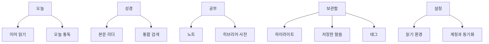
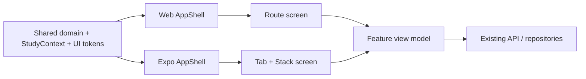

# 성경 읽기·공부·기록 중심 UI/UX 개편 아키텍처

## 1. 문서 목적

KJV 리더노트의 웹과 Expo 앱을 기능 목록 중심 화면에서 `오늘 읽기 -> 본문 이해 -> 구절 선택 -> 공부/기록 -> 다시 찾기` 흐름 중심 제품으로 개편한다.

이 개편은 기존 성경 데이터, 개인 노트, 히브리어 사전, 검색, 통독 기록과 Supabase 계약을 교체하는 작업이 아니다. 기존 도메인 모델은 유지하고 다음 계층을 단계적으로 교체한다.

- 정보 구조와 주요 탐색
- 앱 shell과 반응형 레이아웃
- 읽기 문맥을 유지하는 화면 전환
- 리더의 선택 구절 액션
- 모바일 노트 목록/편집 화면 분리
- 검색, 사전, 하이라이트, 저장한 말씀의 재분류
- 웹·모바일 공통 디자인 token과 상태 계약
- 거대한 화면 컴포넌트의 feature 단위 분리

관련 문서:

- [모바일 화면 최적화 PRD](./mobile-view-optimization-prd.md)
- [개인 노트 편집기 아키텍처](./personal-note-editor-architecture.md)
- [개인 성경공부 워크스페이스 아키텍처](./personal-note-study-workspace-architecture.md)
- [히브리어 성경단어 사전 아키텍처](./hebrew-bible-dictionary-architecture.md)

## 2. 현재 구조 진단

### 2.1 코드 구조

| 표면 | 현재 진입점 | 문제 |
| --- | --- | --- |
| 웹 | `apps/web/src/components/kjv-mvp-app.tsx` | 약 5,100줄에 shell, 화면, modal, 데이터 흐름이 집중됨 |
| 모바일 | `apps/mobile/App.tsx` | 약 6,600줄에 인증, 탭, reader, note, dictionary, modal이 집중됨 |
| 웹 탐색 | `activeView: ViewKey` 조건부 렌더링 | URL, 브라우저 뒤로 가기, deep link와 분리됨 |
| 모바일 탐색 | `activeView`와 quick move modal | screen stack과 복귀 문맥이 없음 |
| 공통 | `packages/shared` 도메인 로직 | UI 문맥과 화면 전환 계약은 아직 공유하지 않음 |

### 2.2 실제 화면에서 확인한 문제

| 영역 | 현재 상태 | 사용자 영향 |
| --- | --- | --- |
| 웹 전역 탐색 | 9개 탭이 1440px에서도 두 줄로 감김 | 위치 파악이 어렵고 본문 시작 위치가 내려감 |
| 웹 홈 | 같은 비중의 대형 카드가 반복됨 | 오늘 할 일보다 빈 데이터와 지표가 먼저 보임 |
| 웹 리더 | 50개 장 버튼, 액션 바, 본문이 동시에 상시 노출됨 | 읽기보다 조작 UI의 시각적 비중이 큼 |
| 웹 리더 본문 | 넓은 본문 안에 원어 요약이 함께 반복됨 | 문장 흐름이 끊기고 스캔 비용이 증가함 |
| 모바일 리더 | 제목과 6개 액션 뒤 약 328px부터 본문이 시작됨 | 작은 화면의 첫 viewport에서 읽을 수 있는 본문이 적음 |
| 모바일 구절 선택 | 선택 구절 액션 패널이 장 전체 본문 뒤에 렌더링됨 | 현재 절에서 노트·저장 작업을 즉시 수행할 수 없음 |
| 모바일 노트 | 목록, 검색, 편집기, template, 저장 버튼이 한 scroll에 있음 | 탐색과 작성이 섞이고 하단 탐색과 겹침 |
| 모바일 기능 발견성 | 노트, 사전, 검색, 통독, 강조가 quick move에 숨겨짐 | 자주 쓰는 공부 기능을 찾기 어려움 |
| 용어 | 장 노트, 구절 노트, 성경노트가 병존함 | 사용자가 어느 노트를 써야 하는지 판단해야 함 |
| 저장 도구 | 강조, 인용, 즐겨찾기 의미가 겹침 | 같은 구절을 어디에 보관할지 불명확함 |

## 3. 제품 경험 원칙

1. **본문 우선**: 리더 첫 viewport의 주인공은 성경 본문이어야 한다.
2. **문맥 유지**: 검색, 사전, 노트로 이동해도 원래 권·장·절·scroll 위치를 잃지 않는다.
3. **선택 즉시 행동**: 절 선택 후 노트, 하이라이트, 저장 액션은 추가 scroll 없이 한 번에 도달한다.
4. **도구 점진 공개**: 기본 화면에는 자주 쓰는 액션만 두고 전문 도구는 panel, sheet, menu로 연다.
5. **하나의 개념, 하나의 이름**: 사용자에게는 하나의 `노트`, 하나의 `저장한 말씀` 체계를 제공한다.
6. **플랫폼에 맞는 표현**: 같은 도메인 계약을 웹은 pane, 모바일은 screen/sheet로 표현한다.
7. **예측 가능한 뒤로 가기**: 모든 상세 화면은 사용자가 출발한 화면과 위치로 복귀한다.
8. **점진적 전환**: 기존 데이터와 화면을 유지한 채 feature flag와 adapter로 화면별 교체가 가능해야 한다.

## 4. 목표 정보 구조

### 4.1 공통 제품 영역



### 4.2 모바일 하단 탐색

하단 탐색은 항상 다섯 개만 유지한다.

| 순서 | 탭 | 포함 기능 |
| --- | --- | --- |
| 1 | 오늘 | 이어 읽기, 오늘 통독, 간략 진행률, 최근 공부 |
| 2 | 성경 | 본문 리더, 권·장 선택 |
| 3 | 공부 | 노트, 히브리어 사전, 최근 단어 연구 |
| 4 | 보관함 | 하이라이트, 저장한 말씀, 태그 |
| 5 | 설정 | 본문, TTS, 테마, 계정, 데이터 |

`빠른이동`은 하단 탭에서 제거한다. 전역 header의 검색/명령 버튼으로 열고, 이동 도구가 아니라 command palette로 유지한다.

### 4.3 웹 전역 탐색

웹은 상단의 가로 탭을 고정 좌측 sidebar로 교체한다.

```text
오늘

읽기
  성경
  본문 검색

공부
  노트
  히브리어 사전

보관함
  하이라이트
  저장한 말씀

통독 현황

설정
```

Sidebar 계약:

- 펼침 너비 `232px`, 접힘 너비 `72px`
- `1024px` 이상에서 고정, `768~1023px`에서는 접힘 기본
- `767px` 이하에서는 모바일 하단 탐색 사용
- account와 설정은 sidebar 하단에 고정
- active 항목은 색상뿐 아니라 indicator와 `aria-current`로 표현
- 항목 수가 늘어나도 두 줄로 감기지 않음

## 5. 탐색과 URL 계약

### 5.1 웹 route

| 경로 | 역할 |
| --- | --- |
| `/app/today` | 오늘 읽기와 통독 요약 |
| `/app/read/[bookId]/[chapter]` | 성경 리더 |
| `/app/search` | 통합 검색 |
| `/app/study` | 공부 hub |
| `/app/study/notes` | 노트 목록 |
| `/app/study/notes/[noteId]` | 노트 편집/읽기 |
| `/app/study/dictionary` | 히브리어 사전 목록 |
| `/app/study/dictionary/[entryId]` | 단어 상세 |
| `/app/library` | 보관함 |
| `/app/progress` | 통독 현황 |
| `/app/settings` | 설정 |

리더 query 계약:

```text
/app/read/gen/1?verse=GEN.1.10&panel=note
/app/read/gen/1?verse=GEN.1.10&panel=dictionary&word=bara
```

`verse`, `panel`, `word`는 private note 내용을 포함하지 않는다. 브라우저 history에는 화면 문맥만 저장한다.

기존 `/app`과 `activeView`는 전환 기간 동안 route adapter로 유지한다.

### 5.2 모바일 route stack

목표 구조는 Expo Router 또는 동등한 React Navigation stack을 사용한다.

```text
/(tabs)/today
/(tabs)/read
/(tabs)/study
/(tabs)/library
/(tabs)/settings
/read/[bookId]/[chapter]
/notes
/notes/[noteId]
/dictionary
/dictionary/[entryId]
/search
```

화면 전환 규칙:

- tab은 최상위 영역만 전환한다.
- 노트 편집, 단어 상세, 검색 결과는 stack push로 연다.
- modal은 확인, 짧은 입력, filter에만 사용한다.
- 긴 본문 편집과 상세 정보는 modal로 열지 않는다.
- Android back, iOS swipe back, 웹 browser back의 결과를 동일하게 정의한다.

## 6. 읽기 문맥 계약

리더에서 공부 도구로 이동할 때 사용할 공통 문맥을 `packages/shared`에 정의한다.

```ts
export type StudyContextSource =
  | "reader"
  | "search"
  | "dictionary"
  | "note"
  | "library"
  | "today";

export type StudyContext = {
  source: StudyContextSource;
  bookId: string;
  chapter: number;
  verseKeys: string[];
  primaryVerseKey?: string;
  selectedText?: string;
  dictionaryEntryId?: string;
  returnTarget: {
    route: string;
    scrollAnchor?: string;
  };
};
```

규칙:

- private note body는 `StudyContext`에 넣지 않는다.
- route 이동 시 `bookId`, `chapter`, `primaryVerseKey`를 보존한다.
- 화면 복귀 시 저장된 verse anchor로 scroll을 복원한다.
- 같은 context에서 note, dictionary, saved verse를 연속 실행할 수 있다.
- 웹과 모바일은 같은 타입을 사용하지만 navigation 구현은 공유하지 않는다.

## 7. App Shell 아키텍처



AppShell 책임:

- 전역 navigation
- account/sync 상태
- 전역 검색과 command palette
- toast와 offline 상태
- TTS mini player
- safe area와 viewport layout

AppShell이 가지지 않는 책임:

- 장 본문 fetch 구현
- note editor state
- dictionary search filter state
- 특정 modal의 form state
- 화면별 긴 JSX

## 8. 핵심 화면 계약

### 8.1 오늘 화면

목표는 통계 dashboard가 아니라 오늘 수행할 일을 보여 주는 것이다.

표시 순서:

1. 이어 읽기: 마지막 권·장·절과 한 개의 주 액션
2. 오늘 통독: 오늘 분량과 완료 상태
3. 진행 요약: 전체/구약/신약의 압축 지표
4. 최근 공부: 최근 노트, 하이라이트, 저장한 말씀 중 최대 3개

레이아웃 규칙:

- 빈 데이터 때문에 고정 높이 대형 card를 만들지 않는다.
- 통독 plan 선택지는 홈에 네 개를 상시 노출하지 않고 `플랜 시작` sheet/dialog에서 선택한다.
- 로그인 유도는 읽기 주 액션보다 강하게 표시하지 않는다.
- 웹은 full-width band와 compact list를 사용하고, 모바일은 세로 흐름을 사용한다.

### 8.2 성경 리더

#### 웹

```text
Chapter Navigator | Scripture Column | Study Context Panel
      240px        |    max 760px     |       340px
```

- chapter navigator는 접을 수 있다.
- 50개 장 버튼은 reader 첫 화면에 항상 펼치지 않는다.
- scripture column은 viewport가 넓어져도 `760px`을 넘지 않는다.
- context panel은 `노트 / 원어 / 연결 / 저장` 탭을 가진다.
- panel을 닫아 집중 읽기 폭을 확보할 수 있다.
- 상단 reader bar는 sticky이며 이전 장, 장 선택, 다음 장, 언어, TTS만 기본 노출한다.
- 읽음 완료, 다중 선택, 장 노트는 overflow menu로 이동한다.

#### 모바일

- 상단 `56px` bar에 이전 장, 권·장, 다음 장만 둔다.
- 언어는 `EN / KR / 동시` segmented control로 합친다.
- 본문은 화면 상단에서 최대 `140px` 이내에 시작해야 한다.
- 절 tap은 선택과 함께 Verse Action Sheet를 연다.
- 절 long press는 다중 선택 mode로 진입한다.
- bottom navigation은 집중 읽기와 TTS 자동 scroll 중 축소 가능하다.
- 장 전환 후 첫 절 또는 이전 scroll 위치로 focus를 이동한다.

#### 본문 표시

- 절 번호는 별도 좁은 column으로 유지한다.
- 절마다 외곽선을 가진 card를 반복하지 않는다.
- 선택, 현재 읽기, 하이라이트 상태는 서로 구분되는 indicator를 사용한다.
- 원어 단어 목록을 절마다 항상 펼치지 않는다.
- 원어가 있는 단어 또는 marker를 누르면 context panel/sheet에서 상세를 연다.
- 한국어·영어 병렬 본문은 문장 단위 대응이 가능한 구조로 표시한다.

### 8.3 Verse Action Surface

현재 장 끝에 렌더링되는 선택 패널을 context surface로 교체한다.

Primary actions:

| 액션 | 동작 |
| --- | --- |
| 노트 | 새 노트 또는 연결된 노트 열기 |
| 하이라이트 | 색상/의미 선택 후 즉시 적용 |
| 저장 | 저장한 말씀 또는 collection 선택 |

Secondary actions:

- 복사
- TTS 읽기
- 히브리어 원어
- 번역 의견
- 기존 노트에 연결

표현 방식:

- 웹: 우측 Study Context Panel 또는 선택 절에 인접한 popover
- 모바일: safe area 위 bottom sheet
- sheet snap point: 요약 `32%`, 상세 `62%`, 편집 `90%`
- action surface는 bottom navigation 위에 위치하며 본문을 가린 상태를 사용자가 닫을 수 있어야 함

### 8.4 노트

사용자에게는 하나의 `노트` 개념만 제공한다.

- `StudyNote` 장/절 메모는 legacy compatibility로 유지한다.
- 새 UX에서는 quick memo도 `PersonalNote`와 verse link로 저장한다.
- 장 노트는 chapter context를 가진 자동 제목 note로 생성한다.
- 구절 노트와 성경노트 생성 버튼을 하나의 `노트` 액션으로 통합한다.

#### 웹

- list `300px` + editor + optional context panel 구조
- list에는 검색, 고정, 최근, 태그, 권 필터만 둔다.
- template은 새 노트 생성 dialog에서 선택한다.
- revision과 backlink는 editor 하단 고정 영역이 아니라 inspector tab으로 이동한다.

#### 모바일

```text
Note List Screen -> Note Editor Screen -> Linked Verse Sheet
```

- 목록과 편집기는 동시에 렌더링하지 않는다.
- 편집기는 full-screen stack screen이다.
- 상단 bar는 뒤로 가기, 제목, 저장 상태, 더보기만 표시한다.
- rich-text toolbar는 keyboard 위에 고정한다.
- 기본 도구는 굵게, 기울임, 밑줄, 형광, undo/redo만 노출한다.
- 색상, 정렬, 목록, template, revision은 더보기로 이동한다.
- 뒤로 가기 전에 local draft를 보존하고 remote save 상태를 표시한다.
- 리더에서 진입한 경우 뒤로 가기는 원래 절로 복귀한다.

### 8.5 히브리어 사전

#### 웹

- 검색/필터 list와 detail의 2-pane 구조를 유지하되 filter 높이를 줄인다.
- alphabet, theme, book, sort는 한 줄 filter bar와 popover로 구성한다.
- 상세 본문은 의미, 문맥, 출현 구절, 연결 노트 순서로 구성한다.
- `내 노트에 추가`는 현재 StudyContext를 유지한 채 note picker를 연다.

#### 모바일

- 검색 결과와 상세를 별도 stack screen으로 분리한다.
- filter는 horizontal active chip + filter sheet로 구성한다.
- 단어 상세에서 출현 구절을 tap하면 리더로 이동하고 뒤로 가면 동일 단어로 복귀한다.
- 노트 추가는 새 노트와 기존 노트 연결을 모두 제공한다.

### 8.6 통합 검색

전역 검색은 세 검색 엔진의 공통 진입점이다.

| 탭 | 대상 |
| --- | --- |
| 성경 | 한국어/KJV 본문 |
| 노트 | 제목, 본문, 태그, 연결 구절 |
| 사전 | 히브리어, 음역, 한국어/영어 뜻 |

- 검색어와 active tab은 route/view state로 보존한다.
- filter는 결과 tab별로 다르게 제공한다.
- 검색 결과 click은 `StudyContext.source = "search"`를 생성한다.
- 결과에서 리더, 노트, 사전으로 이동한 뒤 뒤로 가면 검색어와 scroll을 복원한다.
- 검색 결과에 raw HTML을 사용하지 않고 기존 highlight range renderer를 사용한다.

### 8.7 보관함

기존 `강조`와 `인용`을 사용자 관점에서 재분류한다.

| 사용자 용어 | 내부 데이터 |
| --- | --- |
| 하이라이트 | `Highlight` |
| 저장한 말씀 | `FavoriteVerse`와 collection |
| 태그 | `Tag`, `VerseTag` |

- `인용`이라는 전역 화면 이름은 `저장한 말씀`으로 변경한다.
- 하이라이트는 본문 표시 의미, 저장한 말씀은 재사용/collection 의미로 구분한다.
- 보관함 상단 segmented control로 세 영역을 전환한다.
- 모든 항목은 원래 절 열기, 노트 연결, 복사 액션을 공유한다.

### 8.8 통독과 설정

- 통독 상세는 오늘 화면에서 진입하되 독립 route/screen을 유지한다.
- 완료 장 grid는 권별 접기와 다음 미완료 장 이동을 우선한다.
- 설정은 `읽기 / TTS / 계정·동기화 / 데이터` 네 section으로 정리한다.
- reader에서 자주 조정하는 글자 크기와 line height는 reader display menu에서도 접근 가능하게 한다.

## 9. 용어 계약

| 현재 용어 | 목표 용어 | 이유 |
| --- | --- | --- |
| 홈 | 오늘 | 사용자가 수행할 일을 명확히 함 |
| 인용 | 저장한 말씀 | 북마크/collection 의미를 직접 표현 |
| 강조 | 하이라이트 | 본문 표시 행위와 맞춤 |
| 구절 노트 | 노트 | 중복 노트 개념 제거 |
| 장 노트 | 노트 | chapter context는 metadata로 처리 |
| 성경노트 | 노트 | 제품 전체에서 단일 명칭 사용 |
| 빠른이동 | 명령 검색 | 일반 navigation이 아니라 보조 도구임을 명확히 함 |

기존 데이터 타입과 API 이름은 즉시 바꾸지 않는다. 먼저 표시 용어를 통일하고 데이터 모델 정리는 별도 migration으로 진행한다.

## 10. Component 아키텍처

### 10.1 공통 분류

| 계층 | 역할 | 예시 |
| --- | --- | --- |
| primitive | 작은 시각/입력 단위 | IconButton, SegmentedControl, SheetHandle |
| composite | 반복 가능한 도메인 조합 | VerseRow, NoteListItem, DictionaryResult |
| section | 화면 내 큰 구획 | ReaderHeader, StudyContextPanel, TodayReading |
| screen | route/stack 화면 | ReaderScreen, NoteListScreen, NoteEditorScreen |
| shell | 전역 navigation과 overlay | WebAppShell, MobileAppShell |

Screen은 API 세부 구현이나 대형 modal JSX를 직접 소유하지 않는다. feature hook과 repository를 통해 상태를 받는다.

### 10.2 웹 목표 디렉터리

```text
apps/web/src/
  app/app/
    layout.tsx
    today/page.tsx
    read/[bookId]/[chapter]/page.tsx
    study/notes/page.tsx
    study/notes/[noteId]/page.tsx
    study/dictionary/page.tsx
    library/page.tsx
  components/app-shell/
  features/reader/
    components/
    hooks/
    reader-screen.tsx
  features/notes/
  features/dictionary/
  features/library/
  features/search/
```

### 10.3 모바일 목표 디렉터리

```text
apps/mobile/
  app/
    (tabs)/
      today.tsx
      read.tsx
      study.tsx
      library.tsx
      settings.tsx
    read/[bookId]/[chapter].tsx
    notes/index.tsx
    notes/[noteId].tsx
    dictionary/index.tsx
    dictionary/[entryId].tsx
    search.tsx
  src/components/
  src/features/reader/
  src/features/notes/
  src/features/dictionary/
  src/features/library/
```

### 10.4 공유 가능한 것과 공유하지 않을 것

`packages/shared`에 둔다:

- `StudyContext`
- route/navigation parameter 타입
- 성경·노트·사전 view model 변환
- design token 이름과 semantic value
- 검색 highlight와 reference formatter
- API client와 repository

플랫폼별로 둔다:

- DOM과 React Native 화면 컴포넌트
- sidebar, bottom tab, bottom sheet 구현
- browser/stack navigation adapter
- Tiptap/TenTap editor adapter
- platform accessibility API

웹 JSX를 모바일로 옮기거나 모바일을 WebView로 감싸지 않는다.

## 11. Design System 계약

### 11.1 Semantic token

```ts
type StudyUiTokens = {
  canvas: string;
  surface: string;
  surfaceMuted: string;
  textPrimary: string;
  textSecondary: string;
  scriptureText: string;
  borderSubtle: string;
  actionPrimary: string;
  actionStudy: string;
  actionSave: string;
  focusRing: string;
  success: string;
  warning: string;
  danger: string;
};
```

- canvas/surface를 단일 색조 계열로만 구성하지 않는다.
- 읽기 본문, 공부 액션, 저장 액션은 의미가 다른 색상 token을 사용한다.
- 하이라이트 의미는 색상과 label/icon을 함께 사용한다.
- light/dark theme 모두 같은 semantic token 이름을 사용한다.

### 11.2 크기와 밀도

| 요소 | 계약 |
| --- | --- |
| 최소 touch target | `44 x 44px` |
| 모바일 bottom navigation | safe area 포함 약 `64px` |
| 웹 top bar | `56px` |
| 모바일 reader top bar | `56px` |
| 본문 최대 폭 | 웹 `760px`, 모바일 viewport minus `32px` |
| panel/card radius | 최대 `8px` |
| scripture line height | 사용자 설정 범위 `1.55~2.0` |

UI 글꼴과 성경 본문 글꼴은 역할을 분리한다. 본문 크기는 viewport 폭으로 자동 scaling하지 않고 사용자 설정 token을 사용한다.

## 12. 상태 모델

상태를 네 종류로 분리한다.

| 상태 | 위치 | 예시 |
| --- | --- | --- |
| 원격 도메인 상태 | repository/Supabase | notes, highlights, progress |
| navigation 문맥 | router/stack | active route, StudyContext, return target |
| 화면 임시 상태 | feature hook | filter open, selected tab, sheet snap |
| local draft | device/browser storage | unsaved note document |

금지 사항:

- `AppShell`에 모든 feature state를 추가하지 않는다.
- modal open 상태를 전역 `App.tsx`에 계속 누적하지 않는다.
- 선택 구절 panel을 verse list 뒤 DOM 순서에 의존해 배치하지 않는다.
- remote domain data와 navigation history를 한 object로 저장하지 않는다.

## 13. Offline, 저장과 오류 UX

- 본문 fetch 실패는 reader 영역에서 재시도하고 navigation은 유지한다.
- 노트 remote save 실패 시 local draft와 연결 구절을 유지한다.
- 전역 sync 상태는 AppShell에 작은 indicator로 표시한다.
- screen별 오류는 해당 feature 안에서 표시한다.
- 성공 toast는 동일 작업 반복을 방해하지 않도록 자동 닫는다.
- destructive action은 이름을 명시하고, archive와 permanent delete를 구분한다.
- loading은 전체 blank screen 대신 skeleton 또는 기존 content 유지 방식을 사용한다.

## 14. 접근성 및 반응형 계약

- 웹 keyboard 순서는 sidebar -> top bar -> main -> context panel 순서다.
- route/screen 전환 후 화면 heading 또는 복원 대상 verse로 focus를 이동한다.
- bottom sheet open 시 background를 inert 처리하고 close 후 선택 절로 focus를 복원한다.
- screen reader에 절 번호와 본문을 하나의 읽기 단위로 제공한다.
- 색상 선택에는 색상명과 의미 label을 제공한다.
- `prefers-reduced-motion`에서는 sheet와 panel transition을 줄인다.
- `320`, `390`, `768`, `1024`, `1440px`에서 horizontal page overflow가 없어야 한다.
- 큰 시스템 글꼴에서 toolbar label과 bottom navigation이 잘리지 않아야 한다.
- iOS keyboard, Android back, safe area, 화면 회전을 별도 검증한다.

## 15. 점진적 전환 전략

대규모 일괄 rewrite를 하지 않는다.

1. `uiShellV2` feature flag를 추가한다.
2. 기존 repository와 API를 그대로 사용한다.
3. 공통 token과 StudyContext부터 추가한다.
4. 새 shell 안에서 기존 화면을 legacy adapter로 먼저 연다.
5. Reader -> Notes -> Dictionary/Search -> Library -> Today 순서로 화면을 교체한다.
6. 새 화면 수용 기준을 통과한 뒤 해당 legacy JSX를 제거한다.
7. 마지막에 `activeView`와 단일 파일 modal 상태를 제거한다.

데이터 migration:

- `StudyNote`는 새 Note UX가 안정될 때까지 읽기 fallback으로 유지한다.
- 새 quick note는 `PersonalNote`와 verse link로만 생성한다.
- 기존 Favorite/Highlight 데이터 타입은 유지하고 표시 용어만 먼저 바꾼다.
- route 변경은 기존 `/app` redirect와 query adapter를 제공한다.

## 16. 구현 Phase

### Phase UX-00: 기준선과 계약

- [ ] 현재 주요 흐름의 click 수와 scroll 위치를 기록한다.
- [ ] `StudyContext`, route parameter, semantic token 타입을 정의한다.
- [ ] 기존 component passport를 새 taxonomy로 분류한다.
- [ ] `/app`과 모바일 `activeView` 호환 adapter를 설계한다.
- [ ] UI 개편 feature flag를 추가한다.

### Phase UX-01: App Shell과 Navigation

- [ ] 웹 sidebar와 top bar를 구현한다.
- [ ] 모바일 5개 bottom tab을 구현한다.
- [ ] global search/command entry를 shell에 추가한다.
- [ ] browser/mobile back과 return target을 연결한다.
- [ ] TTS mini player와 sync indicator를 shell slot으로 이동한다.

### Phase UX-02: Reader 중심 개편

- [ ] 웹 reader 3-pane layout을 구현한다.
- [ ] chapter navigator를 접을 수 있게 한다.
- [ ] 모바일 reader header를 축소한다.
- [ ] Verse Action Sheet와 웹 Study Context Panel을 구현한다.
- [ ] long press 다중 선택과 즉시 액션을 구현한다.
- [ ] 원어 marker -> dictionary context 흐름을 구현한다.
- [ ] chapter/verse scroll 복원을 구현한다.

### Phase UX-03: Notes 개편

- [ ] 모바일 note list와 editor를 별도 screen으로 분리한다.
- [ ] 웹 note list/editor/inspector 구조를 구현한다.
- [ ] 구절 노트, 장 노트, 성경노트 표시 개념을 통합한다.
- [ ] template 선택을 note 생성 단계로 이동한다.
- [ ] 모바일 toolbar를 keyboard 위 compact toolbar로 전환한다.
- [ ] 리더 복귀 문맥과 local draft를 검증한다.

### Phase UX-04: Dictionary, Search, Library

- [ ] 모바일 dictionary list/detail을 분리한다.
- [ ] 웹 dictionary filter bar를 압축한다.
- [ ] 성경/노트/사전 통합 검색 shell을 구현한다.
- [ ] 보관함에 하이라이트/저장한 말씀/태그를 통합한다.
- [ ] 모든 result -> detail -> return 흐름에서 scroll을 복원한다.

### Phase UX-05: Today, Progress, Settings

- [ ] 홈을 오늘 화면으로 재구성한다.
- [ ] empty card를 compact state로 전환한다.
- [ ] 통독 plan 시작을 sheet/dialog로 이동한다.
- [ ] progress와 다음 미완료 장 이동을 단순화한다.
- [ ] 설정을 읽기/TTS/계정·동기화/데이터 section으로 정리한다.

### Phase UX-06: 안정화와 Legacy 제거

- [ ] `npm run typecheck`, `npm run lint`, `npm run build`를 통과한다.
- [ ] Expo Doctor와 Android/iOS 실제 기기 smoke를 통과한다.
- [ ] keyboard, screen reader, 큰 글꼴, dark mode를 검증한다.
- [ ] 주요 workflow browser/native 자동화를 추가한다.
- [ ] legacy `activeView`와 중복 modal JSX를 제거한다.
- [ ] component passport와 UI architecture 문서를 최종 갱신한다.

## 17. 정량 수용 기준

| 흐름 | 기준 |
| --- | --- |
| 앱 실행 -> 이어 읽기 | 1회 action |
| 절 선택 -> 노트 작성 시작 | 최대 2회 action, 추가 scroll 없음 |
| 절 선택 -> 하이라이트 | 최대 2회 action |
| 절 선택 -> 히브리어 단어 상세 | 최대 2회 action |
| 검색 결과 -> 원문 -> 검색 복귀 | 검색어와 scroll 100% 보존 |
| 노트 편집 -> 리더 복귀 | 원래 verse anchor 복원 |
| 모바일 reader 본문 시작 | viewport 상단 `140px` 이내 |
| 모바일 선택 액션 | 현재 viewport 또는 bottom sheet에 즉시 표시 |
| 웹 전역 navigation | `1024px` 이상에서 줄바꿈 없음 |
| 반응형 | `320~1440px` page horizontal overflow 없음 |
| touch target | 주요 control 최소 `44 x 44px` |
| 데이터 | 기존 note/highlight/favorite/progress 손실 0건 |

## 18. 출시 게이트

- [ ] 오늘 읽기, 리더, 절 선택, 노트, 사전, 저장한 말씀의 핵심 흐름이 연결된다.
- [ ] 웹과 모바일의 뒤로 가기가 출발 문맥으로 복귀한다.
- [ ] 모바일 선택 구절 액션이 장 끝에 나타나는 기존 문제가 제거된다.
- [ ] 모바일 note list와 editor가 동시에 한 scroll에 나타나지 않는다.
- [ ] 웹의 9개 가로 tab과 항상 펼친 50개 장 selector가 제거된다.
- [ ] 기존 Supabase RLS, revision, note link와 verseKey 계약이 유지된다.
- [ ] 비로그인 local data와 로그인 remote data가 모두 유지된다.
- [ ] 웹/Expo 회귀, 접근성, 반응형, 실제 기기 검증 evidence가 남는다.

## 19. 비목표

- 성경 본문 또는 번역 데이터 교체
- 노트 AI 자동 작성
- 공개 노트/커뮤니티 UI 통합
- 협업 편집
- 기존 데이터의 즉시 destructive migration
- 웹 컴포넌트를 모바일 WebView로 재사용
- 첫 Phase에서 모든 화면을 동시에 교체하는 big-bang rewrite

## 20. 첫 구현 묶음 권고

가장 먼저 구현할 묶음은 다음 네 항목이다.

1. 웹 sidebar와 모바일 5-tab shell
2. 모바일 Verse Action Sheet
3. 웹 Study Context Panel
4. 모바일 note list/editor 분리

이 네 항목은 데이터 모델 변경 없이도 가장 큰 사용성 문제를 해결한다. 이후 `StudyContext`를 기준으로 사전, 검색, 보관함과 오늘 화면을 순차 연결한다.
