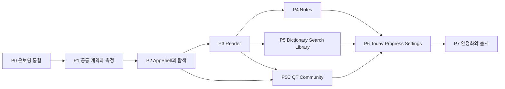

# 성경 공부 중심 UI/UX 개편 실행 플랜

## 1. 목적

KJV 리더노트의 웹과 Expo 앱을 기능 나열형 화면에서 `오늘 읽기 -> 본문 읽기 -> 구절 선택 -> 공부/기록 -> 다시 찾기` 흐름 중심 제품으로 단계적으로 전환한다.

이 문서는 구현 순서, 작업 묶음, 체크박스, 검증 게이트를 정의한다. 화면과 상태 계약의 상세 기준은 [성경 읽기·공부·기록 중심 UI/UX 개편 아키텍처](./bible-study-ui-ux-redesign-architecture.md)를 따른다.

## 2. 기준선과 범위

### 2.1 현재 기준선

| 항목 | 기준 |
| --- | --- |
| 출시 기준 | `main@c04431ec`, `v0.6.1` |
| 온보딩 구현 | `develop/2026-07-13-first-login-onboarding`에 `d7646ffb` 포함 |
| UI/UX 개편 작업 | `D:\kjv-educator-worktrees\personal-note-conflict`, `develop/2026-07-13-first-login-onboarding` |
| 웹 주요 진입점 | `apps/web/src/components/kjv-mvp-app.tsx` |
| 모바일 주요 진입점 | `apps/mobile/App.tsx` |
| 공통 도메인 | `packages/shared` |
| 원격 저장소 | Supabase Auth, Postgres, Storage, RLS |

웹 개편 Shell과 Reader/Notes V2는 기본 활성화하며, 긴급 rollback은 각 `NEXT_PUBLIC_*_V2=false` 환경 변수로 명시한다.

온보딩 기능 커밋 `d7646ffb`는 현재 개발 브랜치의 조상이다. P0 원격 migration/RLS, P2 AppShell, P3 Reader, P4 Notes와 P5 웹 Dictionary의 구현 묶음은 개발 브랜치에 누적되어 있다. `main@c04431ec`의 `0.6.1` QT 커뮤니티, Google OAuth, 버전 계약도 개발 브랜치에 통합했으며 커뮤니티는 웹 독립 sidebar route와 플랫폼별 내부 탭으로 개편한다.

### 2.2 포함 범위

- 첫 로그인 프로필 온보딩과 AppShell 진입 순서
- 웹 sidebar와 route 기반 탐색
- 모바일 5-tab과 stack 기반 탐색
- Reader 본문 우선 레이아웃과 구절 선택 액션
- 노트 목록/편집 화면 분리와 읽기 문맥 복귀
- 히브리어 사전, 통합 검색, 보관함 재구성
- QT 커뮤니티 독립 page, 내부 탭, 통독 포인트와 공개 범위
- 오늘, 통독, 설정 화면 정리
- 웹/모바일 공통 semantic token과 `StudyContext`
- 기존 대형 컴포넌트의 feature 단위 분리
- 접근성, 반응형, 원격 저장, 실제 기기 출시 검증

### 2.3 제외 범위

- 성경 본문과 번역 데이터 교체
- 노트 AI 자동 작성
- 개인 노트의 자동 공개 또는 커뮤니티 글 자동 생성
- 협업 편집
- 여러 단계의 제품 소개 carousel
- 전체 UI 일괄 rewrite
- 웹 UI를 Expo WebView로 재사용

## 3. 실행 원칙

1. 기존 API, repository, RLS 계약을 먼저 유지한다.
2. 새 Shell에서 기존 화면을 adapter로 열고 화면별로 교체한다.
3. 온보딩은 Shell 외부의 auth-entry gate로 유지한다.
4. URL과 stack에 private note body를 저장하지 않는다.
5. 모바일과 웹은 도메인 계약만 공유하고 화면 구현은 분리한다.
6. 각 Phase는 이전 Phase의 수용 기준을 통과한 뒤 진행한다.
7. feature flag로 화면 단위 rollback이 가능해야 한다.
8. 미완성 새 화면 때문에 기존 읽기, TTS, 저장 흐름을 제거하지 않는다.

## 4. 목표 작업 흐름



병렬화 규칙:

- P4 Notes와 P5 Dictionary/Search/Library는 P3의 `StudyContext`와 구절 action 계약이 고정된 뒤 병렬 진행할 수 있다.
- 웹 Shell과 모바일 Shell은 P1 공통 계약 이후 병렬 진행할 수 있다.
- legacy 제거는 대체 화면의 출시 게이트가 통과하기 전 시작하지 않는다.

## 5. Phase P0: 첫 로그인 온보딩 통합

### 목표

기능 브랜치의 온보딩 구현을 개발 기준선에 통합하고, UI Shell 개편보다 먼저 인증 사용자 진입 계약을 고정한다.

### 태스크

- [x] shared profile/status/input/validation/API client를 구현한다. (`d7646ffb`)
- [x] 웹 `/onboarding` route와 `/app` server gate를 구현한다. (`d7646ffb`)
- [x] 모바일 auth-entry profile 조회와 전용 screen을 구현한다. (`d7646ffb`)
- [x] `user_profiles`, public profile 동기화 RPC, avatar Storage migration을 작성한다. (`d7646ffb`)
- [x] 온보딩 기능 `d7646ffb`를 관련 `develop/*`에 통합한다. (`45a99d7d`)
- [x] migration local/remote 이력을 대조한다. (`20260713100929` 일치)
- [x] 원격 Supabase에 migration을 적용한다. (`20260713100929`)
- [x] authenticated 사용자 자기 profile CRUD와 타 계정 차단을 smoke test한다.
- [x] 원격 nickname unique constraint와 avatar bucket/RLS policy를 smoke test한다.
- [ ] API route의 nickname 중복 `409`, avatar MIME/signature/2MB 제한을 검증한다.
- [ ] 계정 삭제 시 private/public profile과 avatar 정리를 검증한다.
- [ ] 완료 사용자의 재로그인 시 온보딩이 다시 열리지 않는지 확인한다.
- [ ] 모바일 권한 거부, 이미지 선택, keyboard, 재시도를 실제 기기에서 확인한다.

### 산출물

- 통합된 온보딩 개발 브랜치
- 적용된 Supabase migration과 RLS smoke 기록
- 웹/모바일 첫 로그인 검증 캡처 또는 테스트 로그
- profile 공개 범위 검증 기록

### 완료 기준

- [ ] 로그인 사용자는 profile 완료 전에 AppShell로 우회할 수 없다.
- [ ] 비로그인 사용자는 온보딩 없이 읽기 화면에 진입한다.
- [ ] 완료 사용자는 추가 화면 없이 요청한 `next` 경로로 이동한다.
- [ ] 저장 실패 후 모든 form 값이 유지된다.
- [ ] 다른 사용자의 private profile을 읽거나 수정할 수 없다.

## 6. Phase P1: 공통 계약, Token, 기준 측정

### 목표

화면 교체 전에 웹과 모바일이 공유할 문맥, route parameter, 디자인 token, 측정 기준을 고정한다.

### 태스크

- [x] `StudyContext`와 `StudyContextSource`를 `packages/shared`에 추가한다.
- [x] `bookId`, `chapter`, `verseKeys`, `primaryVerseKey`, `returnTarget` validation을 추가한다.
- [x] 웹 목표 URL과 legacy query adapter를 정의한다.
- [x] 모바일 route params adapter를 정의한다.
- [x] `uiShellV2`, `readerV2`, `notesV2` feature flag를 추가한다.
- [x] semantic color와 spacing token을 정의한다.
- [x] touch target, panel width, scripture width, radius, line-height 기준을 token화한다.
- [ ] typography, elevation, safe area token을 정의한다.
- [ ] 현재 주요 흐름의 action 수와 첫 본문 위치를 기록한다.
- [ ] `320`, `390`, `768`, `1024`, `1440px` 기준 screenshot을 남긴다.
- [x] 개편 후 Shell을 `320`, `390`, `768`, `1024`, `1440px`에서 캡처한다.
- [ ] 기존 UI 컴포넌트를 primitive/composite/section/screen/shell로 분류한다.
- [x] legacy 화면 adapter의 입력/출력 계약을 작성한다.
- [x] route query serializer에서 `selectedText`를 제외한다.
- [x] 이벤트 측정 시 note body, 선택 본문, 검색 원문을 수집하지 않는 allowlist 정책을 확정한다.

### 산출물

- `packages/shared`의 `StudyContext`와 navigation contract
- 공통 semantic token
- feature flag와 legacy adapter 계약
- 개편 전 기준선 보고서

### 완료 기준

- [x] 웹 URL과 모바일 stack이 동일한 verse context를 표현한다.
- [ ] private text가 route, analytics, error log에 포함되지 않는다.
- [ ] 새 Shell을 꺼도 기존 앱이 동일하게 동작한다.
- [ ] 기준 viewport에서 개편 전 문제를 재현할 수 있다.

## 7. Phase P2: AppShell과 전역 탐색

### 목표

기존 대형 화면을 유지한 채 웹 sidebar와 모바일 tab/stack 기반 Shell을 먼저 도입한다.

### 7.1 웹 태스크

- [x] `WebAppShell`과 route content slot을 추가한다.
- [x] 일반 웹 개발 실행에서 V2 Shell을 기본 활성화하고 명시적 `false` rollback을 유지한다.
- [x] `1024px` 이상 고정 sidebar, `768~1023px` 접힘 sidebar를 구현한다.
- [x] `767px` 이하에서 모바일형 하단 탐색으로 전환한다.
- [x] `오늘 / 성경 / 공부 / 보관함 / 설정` 정보 구조를 적용한다.
- [x] 웹 sidebar에 `함께 > QT 커뮤니티`를 독립 항목으로 추가한다.
- [x] 전역 검색/명령 버튼을 top bar에 추가한다.
- [ ] account, sync 상태, TTS mini player slot을 분리한다.
- [x] active 항목에 `aria-current`와 비색상 indicator를 적용한다.
- [x] 기존 `/app`과 `activeView`를 `/app/today`, `/app/read`, `/app/study/*`, `/app/library`, `/app/settings` route adapter로 연결한다.
- [x] browser back과 `?view=` deep link를 검증한다.
- [x] 목표 `/app/...` route와 Reader 권·장·절 deep link를 검증한다.
- [x] browser forward를 검증한다.

### 7.2 모바일 태스크

- [x] `Today / Read / Study / Library / Settings` 5-tab을 구현한다.
- [ ] Reader, Note Editor, Dictionary Detail, Search를 stack screen으로 분리한다.
- [ ] modal 사용을 확인/짧은 입력/filter로 제한한다.
- [x] Android back의 return target을 연결한다.
- [ ] iOS swipe back의 return target을 연결한다.
- [ ] safe area와 keyboard inset을 Shell 책임으로 분리한다.
- [ ] TTS 재생 중 mini player가 tab content를 가리지 않게 한다.
- [x] 온보딩 완료 profile을 account slot의 단일 source로 사용한다.
- [ ] 기존 `activeView` 화면을 legacy screen adapter로 연다.

### 산출물

- 웹 `WebAppShell`
- 모바일 tab/stack Shell
- legacy route/screen adapter
- 전역 overlay와 account slot 계약

### 완료 기준

- [x] 웹 전역 navigation이 `1024px` 이상에서 줄바꿈되지 않는다.
- [x] 모바일 하단 tab은 5개를 넘지 않는다.
- [ ] tab 전환과 browser back이 데이터 fetch를 불필요하게 반복하지 않는다.
- [ ] 온보딩, 로그인, 비로그인 진입이 새 Shell에서도 유지된다.
- [x] feature flag off에서 기존 Shell로 즉시 돌아갈 수 있다.

## 8. Phase P3: Reader 중심 개편

### 목표

첫 viewport에서 본문을 우선하고 구절 선택 직후 공부/기록 액션에 도달하게 한다.

### 8.1 공통 태스크

- [x] `ReaderHeader`, `VerseRow`, `VerseActions` 표시 책임을 분리한다.
- [x] Expo Reader의 데이터·선택·스크롤·TTS orchestration을 `AppShell`에서 전용 hook으로 분리한다.
- [ ] 웹 `ReaderScreen` 데이터·저장·TTS orchestration을 `KjvMvpApp`에서 분리한다.
- [x] 선택 절, 현재 읽기 절, 하이라이트 상태 indicator를 분리한다.
- [x] `StudyContext` 생성과 return verse anchor 복원을 구현한다.
- [x] Expo 이전/다음 장 이동 후 첫 절 focus와 scroll 규칙을 구현한다.
- [ ] 웹 이전/다음 장 이동 후 focus와 scroll 규칙을 구현한다.
- [ ] TTS, 복사, 저장 기능 회귀 테스트를 추가한다.
- [x] Reader target, TTS queue, 자동 scroll 억제, 다중 선택 범위 회귀 테스트를 추가한다.
- [x] 원어 출현 데이터가 있는 절에만 `원어` context tab을 노출한다.

### 8.2 웹 태스크

- [x] `Chapter Navigator | Scripture | Study Context Panel` 3-pane을 구현한다.
- [x] Scripture 폭을 최대 `760px`로 제한한다.
- [x] chapter navigator를 접을 수 있게 한다.
- [x] `노트 / 원어 / 연결 / 저장` context panel을 구현한다.
- [x] panel을 닫은 집중 읽기 mode를 구현한다.
- [x] 장 탐색에는 현재 장 주변 최대 12개만 표시하고 전체 장은 sheet에서 연다.

### 8.3 모바일 태스크

- [x] reader top bar를 이전 장, 권·장, 다음 장 중심으로 축소한다.
- [x] `EN / KR / 동시` segmented control을 구현한다.
- [x] 절 tap으로 Verse Action Sheet를 연다.
- [x] long press로 다중 선택 mode에 진입한다.
- [x] sheet max-height와 safe area offset을 적용한다.
- [x] 본문이 viewport 상단 `140px` 이내에서 시작하도록 한다.
- [x] bottom tab과 TTS player offset을 sheet에 적용한다.
- [x] keyboard 회피와 2단계 drag snap point를 구현한다.
- [x] Reader에서 검색·노트·사전·보관함으로 이동하는 모바일 context stack과 이전 화면 복귀를 구현한다.
- [x] 리더 헤더에 명령 검색 진입점을 추가하고 검색 push -> Reader pop을 브라우저로 검증한다.
- [ ] keyboard 회피와 drag snap point를 Android/iOS 실제 기기에서 검증한다.

### 산출물

- 웹 3-pane Reader
- 모바일 Verse Action Sheet
- 공통 verse action과 context return 계약
- Reader 회귀 테스트

### 완료 기준

- [x] 절 선택 후 노트, 하이라이트, 저장 시작까지 최대 2회 action이다.
- [x] 모바일 선택 액션을 위해 장 끝까지 scroll할 필요가 없다.
- [x] Reader에서 사전으로 이동 후 원래 절과 context tab으로 복귀한다.
- [x] Expo에서 본문 선택, TTS 자동 scroll, 다중 선택이 서로 충돌하지 않는다.
- [ ] 웹에서 본문 선택, TTS 자동 scroll, 다중 선택 충돌을 자동 검증한다.
- [x] `320~1440px`에서 horizontal page overflow가 없다.

## 9. Phase P4: Notes 작업 공간 개편

### 목표

사용자에게 하나의 `노트` 개념을 제공하고 모바일 목록과 편집을 분리한다.

### 태스크

- [ ] `StudyNote` legacy read adapter와 `PersonalNote` write 정책을 고정한다.
- [ ] 리더의 구절/장 노트 action을 하나의 `노트` action으로 통합한다.
- [x] 웹 list `300px` + editor + inspector 구조를 구현한다.
- [x] 모바일 Note List와 Note Editor를 별도 stack screen으로 분리한다.
- [x] rich-text toolbar를 모바일 keyboard 위에 고정한다.
- [x] 기본 toolbar와 더보기 toolbar의 도구를 분리한다.
- [x] verse autocomplete의 `#창`, `#창 1:10` 흐름을 유지한다.
- [x] local draft와 remote save 상태를 editor header에 표시한다.
- [x] revision conflict 상태와 `서버 버전 사용`/`내 초안 유지` action을 editor header에 표시한다.
- [x] 웹 template 선택을 새 노트 생성 단계로 이동한다.
- [x] 웹 revision, backlink, linked verse를 inspector로 이동한다.
- [ ] 노트에서 Reader로 돌아갈 때 verse anchor를 복원한다.
- [x] note body가 toast, log, URL에 노출되지 않는지 검증한다.

### 완료 기준

- [x] 모바일에서 목록과 편집기가 한 scroll에 동시에 나타나지 않는다.
- [ ] keyboard가 toolbar와 마지막 편집 줄을 가리지 않는다.
- [ ] 저장 실패와 앱 종료 후에도 local draft가 유지된다.
- [ ] 연결 구절 추가/삭제 후 Reader backlink가 일관된다.
- [x] 다른 계정의 note/revision/link를 조회할 수 없다.

## 10. Phase P5: Dictionary, Search, Library 개편

### 10.1 히브리어 사전

- [x] 웹 검색/필터 list + detail 2-pane을 압축한다.
- [x] alphabet/theme/book/sort를 filter bar와 popover로 구성한다.
- [x] 웹 `900px` 이하에서 list/detail을 한 번에 하나만 표시한다.
- [x] 웹 active filter chip과 필터 초기화를 구현한다.
- [ ] 모바일 list/detail을 별도 stack screen으로 분리한다.
- [ ] 모바일 horizontal active filter chip과 filter sheet를 구현한다.
- [x] 단어 상세의 출현 구절에서 Reader로 이동하고 동일 사전 route로 복귀하는 stack 계약을 연결한다.
- [x] 검색어, 선택 단어, alphabet/theme/book/sort를 웹 URL state로 보존한다.
- [x] 간략 목록에 히브리어, Strong 번호, 발음기호, 한국어 발음, 한영 뜻, 첫 출현 구절을 표시한다.
- [x] 목록과 상세의 출현형 히브리어를 의미 있는 `mark` 요소로 강조한다.
- [ ] `내 노트에 추가`에서 현재 `StudyContext`를 유지한다.

### 10.2 통합 검색

- [ ] `성경 / 노트 / 사전` 결과 tab을 구현한다.
- [ ] tab별 검색 엔진과 filter를 분리한다.
- [ ] 검색어, active tab, filter, scroll을 route/view state로 보존한다.
- [ ] 검색 결과에서 Reader/Note/Dictionary로 이동하는 context를 생성한다.
- [ ] raw HTML 없이 highlight range renderer를 사용한다.
- [ ] 검색 결과 복귀 시 query와 scroll을 복원한다.

### 10.3 보관함

- [ ] `하이라이트 / 저장한 말씀 / 태그` segmented view를 구현한다.
- [ ] 기존 `인용` 표시 용어를 `저장한 말씀`으로 변경한다.
- [ ] 항목별 원래 절 열기, 노트 연결, 복사 action을 통일한다.
- [ ] color만으로 하이라이트 의미를 전달하지 않는다.
- [ ] 빈 결과와 filter 없음 상태를 compact하게 표현한다.

### 완료 기준

- [ ] 사전 filter 조합이 occurrence 전체 기준으로 동작한다.
- [x] 웹 사전 상세에서 Reader로 이동하고 브라우저 뒤로 가면 선택 단어와 URL state가 복원된다.
- [x] 웹 `390px`과 `1440px` 사전 화면에 horizontal overflow가 없다.
- [ ] 검색 결과 왕복에서 query와 scroll이 유지된다.
- [ ] 보관함 세 영역의 의미와 저장 action이 겹치지 않는다.
- [ ] 각 상세 화면에서 Reader와 Note로 이동한 뒤 원래 문맥으로 복귀한다.

## 10.5 Phase P5C: QT 커뮤니티 개편

### 목표

`0.6.1`의 커뮤니티 기능과 원격 보안 계약은 유지하고, 홈에 혼합된 긴 화면을 독립 page와 내부 기능 탭으로 재구성한다.

### 태스크

- [x] `main@c04431ec`의 community API, shared client, migrations, OAuth와 `0.6.1` 버전을 개발 브랜치에 통합한다.
- [x] 웹 sidebar에 `함께 > QT 커뮤니티`를 추가하고 `/app/community`로 연결한다.
- [x] 웹 내부 탭 `피드/내 참여/랭킹/설정`을 구현한다.
- [x] `tab=feed|participating|ranking|settings` allowlist, reload, browser back/forward 계약을 추가한다.
- [x] Expo 커뮤니티를 같은 네 가지 내부 탭으로 분리한다.
- [x] 개인 노트가 명시적 게시 없이 커뮤니티에 노출되지 않는 UI·문서 경계를 고정한다.
- [x] Reader V2 TTS queue 완료 callback으로 `chapter_tts`, `today_plan_tts` 읽기 증거를 기록한다.
- [x] Supabase 공개 설정이 없는 개발 환경에서 로그인·회원가입 page가 예외 없이 상태를 표시하게 한다.
- [x] 모바일 오늘 영역에서 커뮤니티 독립 screen push와 back 복귀를 완료한다.
- [ ] authenticated web/Expo에서 작성, 댓글, 도움, 신고, 랭킹 설정을 다시 smoke test한다.
- [ ] 원격 migration/RLS와 reading evidence validation을 재검증한다.
- [ ] Android/iOS에서 작성 keyboard, safe area, tab 전환을 검증한다.

### 완료 기준

- [x] 데스크톱 웹에서 커뮤니티는 상단 tab이나 홈 card가 아니라 sidebar 독립 목적지다.
- [x] 커뮤니티 페이지는 한 번에 하나의 내부 tab panel만 표시한다.
- [x] 유효하지 않은 `tab` query는 route parser에서 거부한다.
- [ ] 로그인 사용자의 커뮤니티 핵심 mutation과 RLS 검증이 통과한다.
- [x] 모바일 하단 탐색은 다섯 개를 넘지 않고 커뮤니티에서 오늘 화면으로 복귀한다.

## 11. Phase P6: Today, Progress, Settings 개편

### 목표

홈을 오늘 수행할 일 중심으로 바꾸고 통독과 설정을 반복 사용에 적합하게 정리한다.

### 태스크

- [ ] 홈을 `오늘` 화면으로 변경한다.
- [ ] 이어 읽기, 오늘 통독, 진행 요약, 최근 공부 순서를 적용한다.
- [ ] 빈 대형 card를 compact empty state로 교체한다.
- [ ] 통독 plan 선택을 sheet/dialog로 이동한다.
- [ ] 완료 장 grid에 권별 접기와 다음 미완료 장 이동을 추가한다.
- [ ] 설정을 `읽기 / TTS / 계정·동기화 / 데이터`로 재구성한다.
- [ ] 글자 크기와 line height를 Reader display menu에서도 변경 가능하게 한다.
- [ ] 프로필 편집을 `계정·동기화 > 프로필`에 연결한다.
- [ ] 최근 공부 항목에서 Note/Verse/Dictionary 문맥을 복원한다.

### 완료 기준

- [ ] 앱 실행 후 이어 읽기는 1회 action으로 시작된다.
- [ ] 빈 데이터가 첫 viewport 대부분을 차지하지 않는다.
- [ ] 통독 plan 시작과 다음 미완료 장 이동이 명확히 분리된다.
- [ ] 설정 변경이 웹과 모바일의 semantic token에 일관되게 적용된다.
- [ ] profile 공개/private 필드가 계정 UI에서 명확히 구분된다.

## 12. Phase P7: 안정화, Legacy 제거, 출시

### 12.1 코드 안정화

- [ ] 대체 완료 화면의 legacy JSX를 제거한다.
- [ ] `kjv-mvp-app.tsx`와 `App.tsx`의 feature state를 각 feature로 이동한다.
- [ ] 중복 modal, style, formatter, navigation helper를 제거한다.
- [ ] component passport를 신규 taxonomy로 갱신한다.
- [ ] feature flag별 rollback 경로를 검증한다.
- [ ] 사용하지 않는 `activeView`와 quick move 상태를 제거한다.

### 12.2 자동 검증

- [ ] `npm run typecheck`
- [ ] `npm run lint`
- [ ] `npm run build`
- [ ] `npm run expo:doctor`
- [ ] `npm run style:mobile`
- [ ] `npm run structure:mobile`
- [ ] Reader, Notes, Search, Onboarding 주요 흐름 자동화
- [ ] Supabase migration 정합성 검사
- [ ] 계정 격리와 RLS smoke test

### 12.3 브라우저와 실제 기기 검증

- [ ] 웹 Chrome, Edge, Safari 최신 버전
- [ ] `320`, `390`, `768`, `1024`, `1440px` screenshot 비교
- [ ] Android 실제 기기: back, keyboard, image picker, TTS, safe area
- [ ] iOS 실제 기기: swipe back, keyboard avoidance, image picker, safe area
- [ ] screen reader, keyboard-only, 큰 시스템 글꼴, reduced motion
- [ ] light/dark theme와 고대비 상태
- [ ] 저속 네트워크와 offline 저장 실패 복구

### 완료 기준

- [ ] 주요 workflow가 새 Shell에서 연결된다.
- [ ] 기존 note/highlight/favorite/progress 데이터 손실이 없다.
- [ ] 계정 간 private data 접근이 차단된다.
- [ ] 화면 겹침과 horizontal overflow가 없다.
- [ ] legacy 화면을 제거해도 feature flag rollback 전략이 문서화되어 있다.
- [ ] 웹 배포와 Android AAB 검증 증거가 남는다.

## 13. 권장 PR 묶음

| 순서 | PR 범위 | 선행 조건 | 독립 rollback |
| --- | --- | --- | --- |
| 1 | 온보딩 원격 migration, RLS, 웹/실기기 검증 | 없음 | 가능 |
| 2 | `StudyContext`, route params, semantic token | PR 1 | 가능 |
| 3 | 웹 AppShell + legacy adapter | PR 2 | 가능 |
| 4 | 모바일 tab/stack Shell + legacy adapter | PR 2 | 가능 |
| 5 | 모바일 Verse Action Sheet | PR 4 | 가능 |
| 6 | 웹 Reader 3-pane과 context panel | PR 3 | 가능 |
| 7 | Reader scroll/return context 통합 | PR 5, 6 | 가능 |
| 8 | Notes list/editor 분리 | PR 7 | 가능 |
| 9 | Dictionary/Search/Library 화면 개편 | PR 7 | 기능별 가능 |
| 10 | QT 커뮤니티 독립 route와 내부 탭 | PR 3, 7 | 가능 |
| 11 | Today/Progress/Settings 개편 | PR 8~10 | 가능 |
| 12 | 접근성, 반응형, 실제 기기 안정화 | PR 3~11 | 수정 단위 가능 |
| 13 | legacy 제거와 release gate | 모든 화면 수용 기준 | 제한적 |

한 PR에서 웹 Shell, 모바일 Shell, Reader, Notes를 동시에 바꾸지 않는다. 공유 계약 변경과 플랫폼 UI 변경을 가능한 한 분리한다.

## 14. 파일 소유 경계

```text
packages/shared/
  StudyContext, route params, view model, validation, API client

apps/web/src/
  components/app-shell/
  features/onboarding/
  features/reader/
  features/notes/
  features/dictionary/
  features/search/
  features/library/
  features/community/

apps/mobile/
  app/ 또는 navigation root
  src/features/onboarding/
  src/features/reader/
  src/features/notes/
  src/features/dictionary/
  src/features/search/
  src/features/library/
  src/features/community/
```

금지 경계:

- `AppShell`이 note editor state나 dictionary filter state를 소유하지 않는다.
- screen이 Supabase query 세부 구현을 직접 가지지 않는다.
- 공통 package가 DOM, React Native component, platform navigation API를 import하지 않는다.
- route adapter가 private note document를 serialize하지 않는다.

## 15. 검증 매트릭스

| 흐름 | 웹 | 모바일 | 원격 DB | 접근성 |
| --- | --- | --- | --- | --- |
| 첫 로그인 | redirect/next | auth-entry/권한 | profile/RLS/avatar | form/live error |
| 이어 읽기 | route/scroll | stack/scroll | progress | focus restore |
| 절 선택 | panel/popover | bottom sheet | 없음 | focus/inert |
| 노트 저장 | editor/inspector | keyboard toolbar | note/revision/RLS | toolbar label |
| 사전 탐색 | 2-pane | list/detail | search RPC | filter name |
| 통합 검색 | URL state | view state | 엔진별 API | result heading |
| 보관함 | segmented view | segmented screen | highlight/favorite/tag | color+label |
| QT 커뮤니티 | sidebar + nested tabs | today entry + nested tabs | thread/comment/reaction/ranking/RLS | tab semantics/live status |

## 16. 위험과 대응

| 위험 | 징후 | 대응 |
| --- | --- | --- |
| 대형 파일 동시 수정 충돌 | `App.tsx`, `kjv-mvp-app.tsx` 충돌 증가 | Shell adapter를 먼저 만들고 feature별 파일로 이동 |
| navigation 이중 상태 | URL과 `activeView`가 다른 화면을 가리킴 | route를 source of truth로 정하고 adapter는 단방향으로 유지 |
| keyboard/sheet 겹침 | 모바일 마지막 줄과 action이 가려짐 | safe area, keyboard inset, 실제 기기 gate 적용 |
| 문맥 복귀 실패 | 검색/사전/노트 뒤로 가기 시 처음으로 이동 | `StudyContext.returnTarget`과 verse anchor 테스트 추가 |
| private data 노출 | URL, log, analytics에 note body 포함 | 구조화된 allowlist event와 redaction test 적용 |
| RLS 회귀 | 타 계정 ID 직접 요청 성공 | 교차 계정 smoke를 모든 원격 데이터 Phase의 필수 gate로 지정 |
| 기능 flag 장기화 | legacy와 v2가 계속 병존 | 화면별 종료 기준과 제거 PR을 P7에 예약 |

## 17. 중단 조건

다음 조건에서는 다음 Phase로 진행하지 않는다.

- 온보딩 migration과 원격 DB 이력이 불일치한다.
- 기존 note/highlight/favorite/progress 데이터를 새 화면에서 읽지 못한다.
- route와 `activeView`가 순환 redirect 또는 back loop를 만든다.
- Reader에서 TTS, 본문 선택, 구절 action 중 하나가 회귀한다.
- 모바일에서 keyboard, sheet, bottom tab이 서로 겹친다.
- 타 계정 private data 접근이 성공한다.
- feature flag off에서 기존 화면으로 복귀할 수 없다.

## 18. 최종 Definition of Done

- [ ] 첫 로그인과 재로그인 흐름이 웹/모바일에서 일관된다.
- [ ] 오늘, 성경, 공부, 보관함, 설정의 정보 구조가 적용된다.
- [x] 웹 QT 커뮤니티가 sidebar 독립 route와 내부 기능 탭으로 분리된다.
- [x] 모바일 QT 커뮤니티가 5-tab을 늘리지 않고 오늘 영역에서 push/pop 된다.
- [ ] Reader 첫 viewport가 조작 UI보다 본문을 우선한다.
- [ ] 구절 선택 후 2회 action 안에 노트, 하이라이트, 저장을 시작한다.
- [ ] 노트, 사전, 검색 상세에서 원래 읽기 문맥으로 복귀한다.
- [ ] 모바일 노트 목록과 편집기가 별도 screen이다.
- [ ] 웹 `1024px` 이상 navigation에 줄바꿈이 없다.
- [ ] `320~1440px`에서 비정상적인 요소 겹침과 horizontal overflow가 없다.
- [ ] keyboard, screen reader, 큰 글꼴, reduced motion을 검증했다.
- [ ] 기존 개인 데이터 손실이 0건이다.
- [ ] Supabase RLS와 계정 격리 검증을 통과했다.
- [ ] 커뮤니티 RLS, 신고, reaction, reading evidence와 개인 노트 비공개 경계를 검증했다.
- [ ] typecheck, lint, build, Expo Doctor, 브라우저/실기기 smoke를 통과했다.
- [ ] legacy 제거 및 rollback 근거가 release report에 남아 있다.
