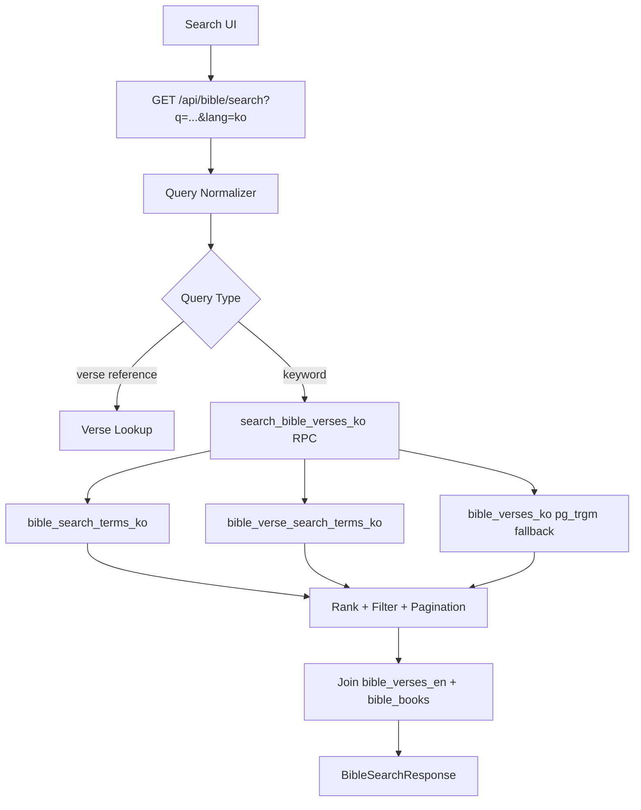

# 한글 키워드 검색엔진 아키텍처

## 1. 목적

KJV Reader Note의 한국어 승인 번역 본문을 DB 기반으로 검색한다. 사용자는 한글 키워드, 복합어, 짧은 구절 조각을 입력하고, 해당 키워드가 포함된 성경 구절 목록을 성경 순서 또는 관련도 순서로 확인할 수 있어야 한다.

현재 `GET /api/bible/search`는 `bible_verses_en.text_en`에 `ilike`를 적용한 뒤 한국어 승인본을 병합한다. 이 구조는 영어 검색에는 동작하지만, 한글 키워드로 한국어 본문을 직접 찾는 요구를 만족하지 못한다. 따라서 한국어 본문을 검색 대상으로 삼는 별도 DB 검색 계층을 둔다.

## 2. 설계 원칙

- 검색 기준 데이터는 `bible_verses_ko`의 `translation_status = 'approved'` 및 `is_public = true` 행이다.
- 검색 결과의 정렬 기준은 기본적으로 `book_order, chapter, verse` 성경 순서를 유지하되, 검색 화면에서 관련도 정렬을 옵션으로 제공할 수 있다.
- 초기 버전은 Supabase/Postgres 내부 기능으로 구현한다. 외부 검색 엔진은 운영 복잡도가 증가하므로 MVP 이후 요구가 명확해질 때 도입한다.
- 한글 형태소 분석을 DB 안에서 완벽하게 해결하려 하지 않는다. 대신 정규화, `pg_trgm`, 키워드 역색인 테이블, 동의어/표기어 사전을 조합한다.
- 사용자 데이터 검색과 본문 검색은 분리한다. 본문 검색은 공개 읽기 대상이고, 강조/인용/노트 검색은 사용자 RLS가 적용된 별도 API에서 처리한다.

## 3. 범위

### 포함

- 한국어 승인 본문 키워드 검색
- 한글 공백/문장부호 정규화
- 단일 키워드, 복수 키워드, 짧은 구절 조각 검색
- 성경 권, 장, 구약/신약 필터
- 검색 결과에서 리더의 해당 절로 이동하기 위한 `verseKey` 반환
- 검색 성능을 위한 `pg_trgm` 인덱스와 부분 인덱스
- 키워드 역색인 테이블을 통한 빠른 exact keyword 검색

### 제외

- AI 의미 검색
- 벡터 검색
- 오프라인 검색
- 사용자 개인 노트 전체 검색
- 외부 Elasticsearch, OpenSearch, Meilisearch 운영

## 4. 전체 구조



## 5. 데이터 모델

### 5.1 기존 테이블

`bible_verses_ko`는 한국어 번역 본문을 절 단위로 저장한다.

- `verse_key`: 영어 원문, 한국어 번역, 사용자 데이터 연결 키
- `text_ko`: 한국어 본문
- `translation_name`: 번역본 이름
- `translation_status`: `approved` 행만 공개 검색 대상
- `is_public`: `true` 행만 공개 검색 대상
- `book_order`, `chapter`, `verse`: 결과 정렬과 필터 기준

기존 `bible_verses_en`은 검색 결과에서 KJV 원문 병기와 출처 정보를 제공하기 위해 조인한다.

### 5.2 정규화 컬럼

한글 검색은 공백, 쉼표, 마침표, 성경체 어미 차이에 민감하다. 직접 본문을 수정하지 않고 검색 전용 정규화 컬럼을 추가한다.

```sql
alter table public.bible_verses_ko
add column if not exists search_text_ko text;

alter table public.bible_verses_ko
add column if not exists search_text_ko_compact text;
```

- `search_text_ko`: 소문자화, 중복 공백 축소, 문장부호 정리 후 검색용 본문
- `search_text_ko_compact`: 공백과 주요 문장부호를 제거한 본문
- 예: `예수 그리스도께서 이르시되` -> `예수그리스도께서이르시되`

`text_ko`가 갱신될 때 trigger로 갱신하거나, 번역 import 스크립트에서 같이 계산한다. 본문 import가 batch 중심이므로 초기에는 import 스크립트 계산을 기본으로 하고, DB trigger는 후속 안정화 단계에서 추가한다.

### 5.3 키워드 사전

자주 검색되는 신학 용어와 표기 변형을 관리하기 위해 검색어 사전 테이블을 둔다.

```sql
create table if not exists public.bible_search_terms_ko (
  id uuid primary key default gen_random_uuid(),
  term text not null,
  normalized_term text not null,
  compact_term text not null,
  term_type text not null default 'keyword'
    check (term_type in ('keyword', 'phrase', 'alias', 'theology')),
  canonical_term text,
  is_public boolean not null default true,
  created_at timestamptz not null default now(),
  unique(normalized_term, term_type)
);
```

예시:

| term | canonical_term | term_type |
| --- | --- | --- |
| 하나님 | 하나님 | theology |
| 주 예수 | 예수 그리스도 | alias |
| 성령 | 성령 | theology |
| 믿음 | 믿음 | keyword |
| 왕국 | 왕국 | keyword |

### 5.4 구절-키워드 역색인

검색어가 정확한 키워드일 때 본문 전체를 매번 스캔하지 않도록 구절과 키워드의 연결 테이블을 둔다.

```sql
create table if not exists public.bible_verse_search_terms_ko (
  verse_key text not null,
  search_term_id uuid not null references public.bible_search_terms_ko(id) on delete cascade,
  translation_name text not null,
  match_count int not null default 1 check (match_count > 0),
  first_position int,
  created_at timestamptz not null default now(),
  primary key (verse_key, search_term_id, translation_name)
);
```

이 테이블은 다음 용도로 사용한다.

- exact keyword 검색 응답 속도 개선
- 동의어/표기어 검색
- 검색 관련도 계산
- 향후 관리자 화면에서 “이 키워드에 연결된 구절” 검수

## 6. 인덱스 전략

### 6.1 확장

```sql
create extension if not exists pg_trgm;
```

### 6.2 본문 trigram 인덱스

한국어 `LIKE '%검색어%'`, `ILIKE`, 유사도 검색을 위해 GIN trigram 인덱스를 사용한다.

```sql
create index if not exists bible_verses_ko_search_text_trgm_idx
on public.bible_verses_ko
using gin (search_text_ko gin_trgm_ops)
where is_public = true and translation_status = 'approved';

create index if not exists bible_verses_ko_search_compact_trgm_idx
on public.bible_verses_ko
using gin (search_text_ko_compact gin_trgm_ops)
where is_public = true and translation_status = 'approved';
```

부분 인덱스를 쓰는 이유는 공개 승인본만 검색 대상이므로 draft/reviewing 행을 인덱스에서 제외해 저장 공간과 쓰기 비용을 줄이기 위해서다.

### 6.3 역색인 테이블 인덱스

```sql
create index if not exists bible_search_terms_ko_compact_idx
on public.bible_search_terms_ko (compact_term)
where is_public = true;

create index if not exists bible_verse_search_terms_ko_term_idx
on public.bible_verse_search_terms_ko (search_term_id, translation_name);

create index if not exists bible_verse_search_terms_ko_verse_idx
on public.bible_verse_search_terms_ko (verse_key);
```

### 6.4 위치 필터 인덱스

기존 `bible_verses_ko_location_idx`와 `bible_verses_ko_public_idx`를 유지한다. 검색 API가 `book_order`, `chapter`, `translation_name`, 공개 상태를 함께 필터링하므로 필요하면 아래 복합 부분 인덱스를 추가한다.

```sql
create index if not exists bible_verses_ko_public_location_idx
on public.bible_verses_ko (translation_name, book_order, chapter, verse)
where is_public = true and translation_status = 'approved';
```

## 7. 검색 쿼리 흐름

### 7.1 입력 정규화

API에서 먼저 검색어를 정규화한다.

1. 앞뒤 공백 제거
2. Unicode normalize `NFKC`
3. 중복 공백 제거
4. 주요 문장부호 제거 또는 공백화
5. compact query 생성
6. 최소 길이 검사

정책:

- 1글자 검색은 기본 차단한다.
- 2글자 이상 검색을 허용한다.
- 공백 제거 후 2글자 미만이면 빈 결과를 반환한다.
- 최대 검색어 길이는 80자로 제한한다.

### 7.2 검색 순서

1. 성경 구절 참조인지 검사한다. 예: `요 3:16`, `요한복음 3장 16절`
2. 키워드 사전 exact match를 조회한다.
3. `bible_verse_search_terms_ko`에서 연결 구절을 찾는다.
4. 역색인 결과가 부족하면 `bible_verses_ko.search_text_ko` trigram 검색을 수행한다.
5. phrase 검색은 `search_text_ko_compact like '%compact_query%'`로 보강한다.
6. 중복 `verse_key`를 제거하고 점수를 합산한다.
7. 필터와 페이지네이션을 적용한다.

### 7.3 랭킹

초기 랭킹은 단순하고 설명 가능한 점수로 둔다.

| 조건 | 점수 |
| --- | ---: |
| 키워드 역색인 exact match | +100 |
| canonical term match | +80 |
| compact phrase 포함 | +60 |
| 일반 본문 포함 | +40 |
| match_count 1회당 | +5 |
| 검색어가 절 앞부분에 등장 | +10 |

정렬 옵션:

- `sort=canonical`: `book_order, chapter, verse`
- `sort=relevance`: `score desc, book_order, chapter, verse`

기본값은 성경 앱 사용 맥락에 맞게 `canonical`로 둔다.

## 8. DB 함수

REST 필터만으로 랭킹과 fallback 병합을 처리하면 API 코드가 복잡해진다. Postgres RPC 함수로 검색 로직을 캡슐화한다.

```sql
create or replace function public.search_bible_verses_ko(
  p_query text,
  p_translation_name text default 'KJV Reader Note',
  p_testament text default null,
  p_book_id text default null,
  p_limit int default 50,
  p_offset int default 0,
  p_sort text default 'canonical'
)
returns table (
  verse_key text,
  app_book_id text,
  book_order int,
  chapter int,
  verse int,
  text_ko text,
  text_en text,
  translation_name text,
  score int,
  source_name text,
  source_module text,
  source_module_version text
)
language sql
stable
as $$
  -- 실제 구현에서는 query normalization helper를 함수화하고,
  -- 역색인 match와 trigram fallback을 union한 뒤 verse_key별 최고 점수를 선택한다.
  select
    ko.verse_key,
    ko.app_book_id,
    ko.book_order,
    ko.chapter,
    ko.verse,
    ko.text_ko,
    en.text_en,
    ko.translation_name,
    40 as score,
    en.source_name,
    en.source_module,
    en.source_module_version
  from public.bible_verses_ko ko
  join public.bible_verses_en en on en.verse_key = ko.verse_key
  join public.bible_books b on b.app_book_id = ko.app_book_id
  where ko.translation_status = 'approved'
    and ko.is_public = true
    and ko.translation_name = p_translation_name
    and (p_testament is null or b.testament = p_testament)
    and (p_book_id is null or ko.app_book_id = p_book_id)
    and (
      ko.search_text_ko ilike '%' || p_query || '%'
      or ko.search_text_ko_compact ilike '%' || replace(p_query, ' ', '') || '%'
    )
  order by
    case when p_sort = 'relevance' then 40 end desc,
    ko.book_order asc,
    ko.chapter asc,
    ko.verse asc
  limit greatest(1, least(p_limit, 100))
  offset greatest(0, p_offset);
$$;
```

주의: 위 SQL은 문서용 골격이다. 실제 migration에서는 정규화 함수, exact keyword CTE, trigram fallback CTE, score 병합, `explain analyze` 검증을 포함한다.

## 9. API 설계

### 9.1 엔드포인트

기존 엔드포인트를 확장한다.

```text
GET /api/bible/search?q=믿음&lang=ko&sort=canonical&limit=50
```

파라미터:

| 이름 | 기본값 | 설명 |
| --- | --- | --- |
| `q` | required | 검색어 |
| `lang` | `ko` | `ko`, `en`, `all` |
| `translation` | public config | 한국어 번역본 이름 |
| `testament` | null | `OT`, `NT` |
| `bookId` | null | `gen`, `jhn` 같은 앱 권 id |
| `sort` | `canonical` | `canonical`, `relevance` |
| `limit` | 50 | 최대 100 |
| `offset` | 0 | 페이지네이션 |

### 9.2 응답

기존 `BibleSearchResponse`와 호환하되 검색 메타데이터를 확장한다.

```ts
type BibleSearchResponse = {
  query: string;
  normalizedQuery?: string;
  lang?: "ko" | "en" | "all";
  source: BibleSource;
  total?: number;
  verses: Verse[];
};
```

`Verse`는 기존 구조를 유지한다.

- `verseKey`
- `bookId`
- `chapter`
- `verse`
- `textEn`
- `textKo`
- `translationName`
- `translationStatus`

## 10. 앱 계층 변경

### 10.1 서버 라우트

`src/app/api/bible/search/route.ts`를 다음 흐름으로 바꾼다.

1. `q`, `lang`, `bookId`, `testament`, `sort`, `limit`, `offset` 파싱
2. 검색어 길이와 허용 문자 검증
3. `lang=ko`이면 `search_bible_verses_ko` RPC 호출
4. `lang=en`이면 기존 영어 검색 또는 영어 FTS 함수 호출
5. `lang=all`이면 한국어/영어 결과를 병합
6. `BibleSearchResponse`로 매핑

Supabase REST에서 RPC는 `/rest/v1/rpc/search_bible_verses_ko`로 호출하거나, 서버 전용 Supabase client를 사용한다. 서버 라우트에서는 anon key만으로 공개 읽기 함수 호출이 가능해야 하며 service role key를 사용하지 않는다.

### 10.2 클라이언트

검색 UI는 최소한 다음 상태를 가진다.

- 입력 중
- 검색 중
- 결과 있음
- 결과 없음
- 검색어가 너무 짧음
- 오류

검색 결과 항목은 성경 위치, 한국어 본문, 선택 시 이동할 `verseKey`, 원문 병기 표시 여부를 포함한다.

## 11. Import와 인덱스 갱신

한국어 번역 import 후 아래 작업을 수행한다.

1. `bible_verses_ko.search_text_ko`와 `search_text_ko_compact` 갱신
2. `bible_search_terms_ko` 사전 seed 적용
3. `bible_verse_search_terms_ko` 재생성
4. 검색 smoke test 실행
5. `explain analyze`로 대표 검색어 성능 확인

재생성은 idempotent 해야 한다.

```sql
delete from public.bible_verse_search_terms_ko
where translation_name = 'KJV Reader Note';

insert into public.bible_verse_search_terms_ko (...)
select ...
from public.bible_verses_ko ko
join public.bible_search_terms_ko term
  on ko.search_text_ko_compact like '%' || term.compact_term || '%'
where ko.translation_status = 'approved'
  and ko.is_public = true;
```

## 12. 보안과 권한

- `bible_verses_ko`, `bible_verses_en`, `bible_books`는 공개 읽기 정책만 허용한다.
- `draft`, `reviewing`, `needs_check` 한국어 번역은 검색 결과에 노출하지 않는다.
- 검색 함수는 `stable` 함수로 두고 데이터 변경을 수행하지 않는다.
- exposed schema의 함수 권한은 필요한 role에만 부여한다.
- service role key는 API route 검색 호출에 사용하지 않는다.
- 사용자 강조/인용 검색은 별도 authenticated API에서 RLS로 소유권을 검증한다.

## 13. 성능 목표

| 항목 | 목표 |
| --- | ---: |
| 단일 키워드 검색 p95 | 300ms 이하 |
| phrase 검색 p95 | 600ms 이하 |
| API 전체 응답 p95 | 1초 이하 |
| 기본 결과 limit | 50 |
| 최대 결과 limit | 100 |

대표 검색어:

- `하나님`
- `예수`
- `성령`
- `믿음`
- `왕국`
- `생명`
- `예수 그리스도`

검증 쿼리:

```sql
explain analyze
select *
from public.search_bible_verses_ko('믿음', 'KJV Reader Note', null, null, 50, 0, 'canonical');
```

## 14. 단계별 구현 계획

세부 구현 체크리스트는 [한글 키워드 검색 구현 페이즈](./korean-search-phases/README.md)에 별도 파일로 분리한다.

### Phase A: DB 기반 한국어 검색 MVP

- `pg_trgm` 확장 추가
- `search_text_ko`, `search_text_ko_compact` 컬럼 추가
- 공개 승인본 부분 trigram 인덱스 추가
- `search_bible_verses_ko` RPC 함수 추가
- `/api/bible/search?lang=ko` 연동
- 검색 UI에서 한글 검색 결과 노출

### Phase B: 키워드 사전과 역색인

- `bible_search_terms_ko` 테이블 추가
- `bible_verse_search_terms_ko` 테이블 추가
- 신학 핵심 키워드 seed 추가
- import 후 역색인 재생성 스크립트 추가
- exact keyword match와 trigram fallback 병합

### Phase C: 운영 최적화

- 검색 로그 또는 익명 집계로 상위 검색어 확인
- 누락 동의어를 사전에 반영
- `explain analyze` 결과를 release readiness report에 포함
- 성능 목표 미달 시 외부 검색 엔진 도입 여부 재검토

## 15. 수용 기준

- `믿음` 검색 시 한국어 승인 본문에서 해당 구절들이 반환된다.
- `예수 그리스도` 검색 시 공백 포함/미포함 변형을 모두 처리한다.
- 결과는 기본적으로 성경 순서로 정렬된다.
- 권별 필터를 적용하면 해당 권의 결과만 반환된다.
- `draft` 또는 비공개 한국어 번역은 검색되지 않는다.
- 검색 결과에서 `verseKey`로 리더의 해당 구절 위치로 이동할 수 있다.
- 대표 검색어 7개가 staging DB에서 p95 1초 이하로 응답한다.

## 16. 향후 확장 판단 기준

다음 조건 중 2개 이상이 반복되면 외부 검색 엔진 도입을 검토한다.

- 관련도 정렬 품질이 사용자 요구를 만족하지 못한다.
- 동의어/표기어 사전 관리가 DB seed만으로 감당하기 어렵다.
- 검색 결과 하이라이트, 오타 보정, 자동완성 요구가 핵심 기능이 된다.
- 공개 번역본이 여러 개로 늘어나고 통합 검색 latency가 1초를 자주 넘는다.
- 관리자 검색/검수 도구가 복잡한 facet 검색을 요구한다.

외부 엔진 후보는 Meilisearch, Typesense, OpenSearch 순서로 검토한다. 단, MVP에서는 Supabase/Postgres 내부 검색으로 시작한다.
