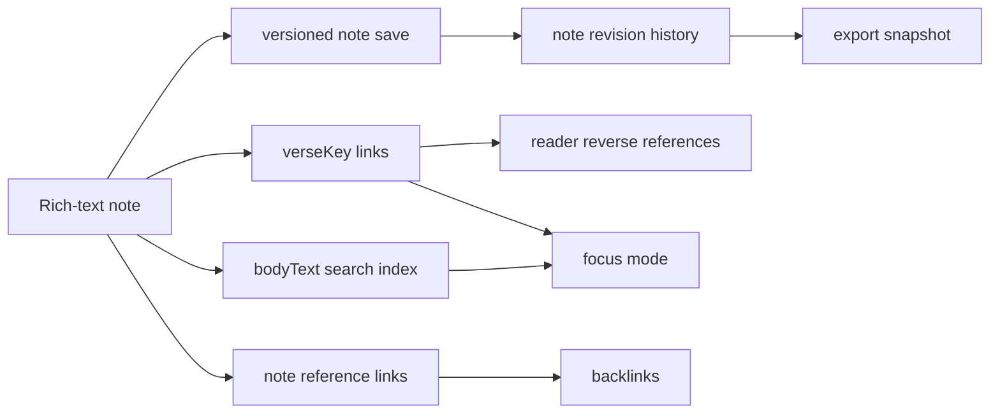

# 개인 성경공부 워크스페이스 확장 아키텍처

## 1. 목적

개인 노트를 단순 편집 화면이 아니라 안전하게 축적·연결·재발견·보관하는 개인 성경공부 워크스페이스로 확장한다. 이 문서는 rich-text 편집기와 인라인 구절 태그 이후의 후속 아키텍처이며, 아래 기능을 하나의 데이터 및 UX 흐름으로 다룬다.

1. 저장 충돌 감지와 버전 복구
2. 리더의 구절-노트 역참조
3. 원격 노트 검색과 결과 강조
4. 성경공부 템플릿
5. 노트 간 링크와 역링크
6. 개인 데이터 내보내기와 백업
7. 집중 모드

모든 데이터는 사용자 private study data다. 공유 노트, 공동 편집, 공개 그래프, AI 자동 작성은 이 범위에 포함하지 않는다.

## 2. 현재 기반과 설계 원칙

- `PersonalNote`, `PersonalNoteVerseLink`, `VerseTag`와 원격 Supabase note CRUD가 이미 있다.
- `verseKey`는 성경 본문, 히브리어 사전, 개인 노트를 잇는 영속 키다.
- rich-text 노트의 원본은 `PersonalNoteDocument` JSON이며, `bodyText`는 검색용 파생 데이터다.
- 원격 변경은 optimistic concurrency로 보호하고, 성공한 저장만 revision으로 기록한다.
- 모든 개인 API는 authenticated 사용자와 RLS를 통해 `user_id = auth.uid()` 범위를 강제한다.
- local draft는 네트워크 실패 복구용이며, 원격 revision을 대체하는 진실의 원천이 아니다.



## 3. 버전, 충돌, 복구

### 3.1 데이터 모델

`user_personal_notes`에 현재 revision을 추가한다.

```sql
alter table public.user_personal_notes
  add column revision integer not null default 1,
  add column archived_at timestamptz;

create table public.user_personal_note_revisions (
  id uuid primary key default gen_random_uuid(),
  user_id uuid not null references auth.users(id) on delete cascade,
  note_id uuid not null references public.user_personal_notes(id) on delete cascade,
  revision integer not null,
  title text not null,
  body_document jsonb,
  body_text text not null,
  snapshot_reason text not null check (snapshot_reason in ('create', 'save', 'restore')),
  created_at timestamptz not null default now(),
  unique (note_id, revision)
);
```

revision snapshot에는 본문과 제목만 저장한다. 태그, 연결 구절, 노트 링크는 해당 revision 시점의 관계 snapshot을 JSON으로 추가하기 전까지 현재 관계로 유지한다. 이는 복원 기능의 첫 범위를 본문 복구로 제한해 과도한 관계 복제를 피한다.

### 3.2 저장 계약

```http
PATCH /api/me/notes/{noteId}
If-Match-Revision: 12
```

서버는 `revision = 12`인 행만 갱신하고 한 transaction 안에서 `revision = 13`과 revision snapshot을 만든다. 행이 갱신되지 않으면 `409 note_revision_conflict`와 현재 revision 번호를 반환한다.

클라이언트는 마지막으로 성공한 revision, 현재 draft, 마지막 remote snapshot을 분리 보관한다. 충돌 화면은 다음 선택지만 제공한다.

- 내 변경 검토: local draft와 최신 remote 본문 비교
- 최신 버전 사용: local draft를 별도 local draft로 보존하고 remote를 편집기에 적용
- 내 변경 복제: 새 노트로 만들기
- 선택 영역 수동 병합: 자동 병합이 아닌 명시적 편집으로 해결

자동 병합은 rich-text mark와 verse node를 잘못 합칠 위험이 있어 첫 릴리스에 포함하지 않는다.

### 3.3 버전 관리

- 명시 저장과 debounce 자동 저장 모두 성공 시에만 snapshot을 만든다.
- 같은 내용의 반복 저장은 새 revision을 만들지 않는다.
- 노트당 최근 50개 revision 또는 180일을 유지하고, 오래된 snapshot은 background cleanup으로 정리한다.
- revision 복원은 새 revision을 만드는 append-only 동작이다. 과거 기록을 덮어쓰지 않는다.
- 삭제는 즉시 hard delete 대신 `archived_at`으로 이동하고, 30일 안에는 복원할 수 있게 한다. 완전 삭제는 별도 확인 뒤 cascade 삭제한다.

## 4. 리더 역참조

리더의 선택 구절 또는 절 상세에는 현재 사용자만 볼 수 있는 `이 구절이 포함된 노트` 섹션을 둔다. 결과는 노트 제목, 최신 본문 일부, 태그, 마지막 수정일, link source를 표시하고 최대 10개까지 노출한다.

```http
GET /api/me/verse-notes?verseKey=GEN.1.10&limit=10
```

서버는 `user_personal_note_verse_links`와 active note를 join하고, `user_id`와 `verse_key` 인덱스를 사용한다. 응답은 note body 전체를 반환하지 않으며 `excerpt`만 제공한다. 더보기는 노트 검색 화면의 verseKey 필터로 이동한다.

구절 역참조는 reader에서 추가한 링크, rich-text `verseReference`, 히브리어 사전에서 추가한 예시 구절을 동일한 `verseKey`로 찾는다. 노트에 연결만 있고 본문에 삽입되지 않은 구절도 포함한다.

## 5. 노트 검색

### 5.1 검색 표면

노트 검색은 제목, `bodyText`, 태그명, 구절 참조, 히브리어 사전에서 삽입한 표제어를 대상으로 한다. 검색 결과는 제목, 본문 일치 문장, 연결 구절, 태그, 수정일을 보여 준다.

지원 필터:

| 필터 | 기준 |
| --- | --- |
| 일반 검색어 | title, bodyText, tag name |
| 구절 | `verseKey` 또는 `창 1:10` 표기 |
| 권 | 연결 구절의 `book_id` |
| 태그 | note tag / verse tag |
| 상태 | active, archived |
| 정렬 | 관련도, 최근 수정, 성경순 |

### 5.2 원격 검색 계약

```http
GET /api/me/notes/search?q=%EC%B0%BD%EC%A1%B0&bookId=gen&tagId=uuid&cursor=...&sort=relevance
```

초기 검색은 `title`, `body_text`의 `pg_trgm` 인덱스와 정확한 tag/verse link join으로 구현한다. 한국어 형태소 분석이나 embedding 검색은 실제 검색 품질 데이터가 쌓인 뒤 후속 범위로 둔다.

검색 결과 highlight는 서버가 HTML을 반환하지 않고 `{ start, end }` 범위 또는 match token을 반환한다. 클라이언트 renderer가 안전하게 강조한다. 검색 API와 역참조 API 모두 개인 note 본문을 다른 사용자에게 노출하지 않는다.

## 6. 템플릿

템플릿은 새 노트의 시작 문서만 제공하며, 기존 노트와 연결되지 않는다. 처음에는 앱에 포함된 고정 template을 제공한다.

| 템플릿 | 기본 block |
| --- | --- |
| 관찰·해석·적용·기도 | 제목, 관찰, 해석, 적용, 기도 heading |
| 설교 준비 | 본문, 핵심 주제, 구조, 적용, 참고 구절 |
| 히브리어 단어 연구 | 단어, 발음, 의미, 출현 구절, 문맥, 묵상 |

사용자 template은 `user_personal_note_templates`에 private JSON document로 저장한다. template 적용은 deep copy 후 새 note draft에 넣고, 이후 template 변경이 기존 note를 수정하지 않게 한다.

## 7. 노트 링크와 역링크

rich-text schema에 `noteReference` inline node를 추가한다.

```ts
type NoteReferenceNode = {
  type: "noteReference";
  attrs: { targetNoteId: string; label: string };
};
```

사용자가 `[[`를 입력하면 자신의 note title을 검색해 후보를 보여 주고, 선택 시 `noteReference` node로 넣는다. 영속 관계는 별도 테이블로 만든다.

```sql
create table public.user_personal_note_links (
  user_id uuid not null references auth.users(id) on delete cascade,
  source_note_id uuid not null references public.user_personal_notes(id) on delete cascade,
  target_note_id uuid not null references public.user_personal_notes(id) on delete cascade,
  created_at timestamptz not null default now(),
  primary key (source_note_id, target_note_id),
  check (source_note_id <> target_note_id)
);
```

역링크는 target note 상세의 `이 노트를 참조하는 노트`에 최대 20개를 보인다. 순환 링크는 허용하지만 자동 탐색은 한 단계까지만 수행한다. 대상 노트가 archive되면 node는 `보관된 노트`로 표시하고 링크 행은 유지한다.

## 8. 내보내기와 백업

### 8.1 형식

| 형식 | 용도 | 포함 내용 |
| --- | --- | --- |
| JSON | 완전 백업/복원 준비 | note document, revision metadata, tags, verse links, note links |
| Markdown ZIP | 다른 도구에서 읽기 | note별 Markdown, 구절 표기, tags, manifest |
| PDF | 인쇄/공유용 읽기본 | 선택 노트의 read-only 렌더링 |

첫 릴리스는 export만 제공한다. JSON import는 schema version 검사, dry-run, 충돌 정책이 필요하므로 별도 설계 전에는 제공하지 않는다.

### 8.2 API와 보안

- `POST /api/me/notes/export`는 인증된 현재 사용자 데이터만 생성한다.
- 대용량 JSON/ZIP은 서버 job으로 생성하고 15분 만료 signed download URL을 발급한다.
- PDF는 선택한 noteId 목록만 받고, 서버의 safe renderer로 생성한다.
- export job과 audit log에는 본문을 기록하지 않고 note 수, 형식, 성공/실패만 남긴다.
- 계정 삭제 흐름은 삭제 전 JSON export를 명시적으로 제공한다.

## 9. 집중 모드

집중 모드는 새 데이터 모델이 아니라 노트 편집 화면의 view state다. 활성화하면 전역 navigation, 목록 pane, 불필요한 도구를 숨기고 다음만 보여 준다.

- 현재 노트 제목과 저장 상태
- rich-text 본문
- 현재 선택/연결 구절 패널
- 최소 툴바와 집중 모드 종료 control

연결 구절 패널은 선택한 `verseKey`의 한국어/영어 본문을 접어서 표시하고, 탭하면 reader의 해당 절로 이동한다. 사용자 설정에는 마지막 집중 모드 사용 여부만 저장하며, 임시 layout state는 URL이나 원격 DB에 저장하지 않는다.

## 10. 권한, 성능, 관측성

- revision, template, note link, export job 테이블은 모두 RLS와 parent note/template 소유권 검증을 적용한다.
- `user_id, note_id, revision desc`, `user_id, verse_key`, `target_note_id`, `user_id, updated_at desc` 인덱스를 추가한다.
- 검색 결과와 역참조 결과는 cursor pagination을 사용하고 본문 전체를 목록 응답에 담지 않는다.
- note body, revision body, export 본문은 application log, analytics event, error detail에 기록하지 않는다.
- 관측성은 저장 충돌 수, revision 복원 수, export 성공/실패 수, 검색 latency만 익명 집계한다.

## 11. 구현 순서와 수용 기준

개별 구현 문서는 [personal-note-study-workspace-phases/README.md](./personal-note-study-workspace-phases/README.md)에서 관리한다.

최종 수용 기준:

- [x] 두 기기에서 동시에 수정해도 사용자의 본문이 조용히 덮어써지지 않는다.
- [x] 리더에서 현재 구절에 연결된 개인 노트를 찾을 수 있다.
- [x] 사용자는 제목, 본문, 태그, 권, 구절로 노트를 다시 찾을 수 있다.
- [x] template, note link, focus mode가 rich-text/verse node와 함께 작동한다.
- [x] 사용자는 자신의 데이터를 JSON과 Markdown으로 내보낼 수 있다.
- [x] 다른 사용자는 노트, revision, template, backlink를 교차 계정에서 읽거나 수정할 수 없다.

### 11.1 2026-07-12 구현 상태와 운영 경계

- revision RPC는 optimistic concurrency, 동일 내용 저장 생략, append-only 복원과 409 충돌 응답을 제공한다.
- revision은 매일 원격 Cron으로 정리하며 최근 50개를 초과하고 180일보다 오래된 항목만 삭제한다.
- 검색 API는 본문·제목·태그, 권·구절·상태 필터, cursor와 안전한 문자 범위 응답을 제공한다.
- 기본/사용자 template, 노트 링크와 역링크, 구절 역참조, archive/restore, 집중 모드 구절 패널을 제공한다.
- JSON과 Markdown ZIP은 인증된 요청에서 즉시 생성한다. 현재 데이터 규모에서는 signed URL job보다 단순한 private no-store 응답을 사용하며, 대용량 계정 전환 시 15분 signed URL queue로 교체한다.
- PDF는 브라우저의 read-only 인쇄 경로를 사용한다. 서버 PDF renderer는 대량 export job과 함께 후속 전환한다.
