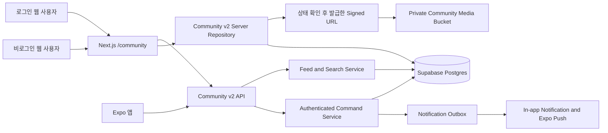
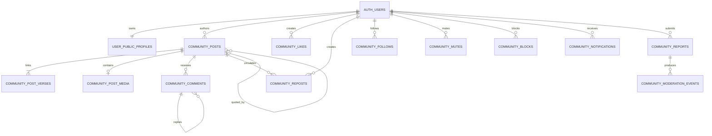

# QT 소셜 커뮤니티 아키텍처

> 상태: 구현 완료. 2026-07-28 온보딩 프로필 단일 원본 강제와 레거시 채널 폐기까지 반영. 원격 migration·DB RLS smoke·타입·린트·웹 빌드·HTTP route smoke·Expo Doctor 검증 완료. 실제 키 기반 인증 API smoke와 실제 기기 push/keyboard 검증은 환경 gate로 분리
> 결정일: 2026-07-23
> 구현 갱신: 2026-07-28
> 적용 범위: `apps/web`, `apps/mobile`, `packages/shared`, Supabase
> 기존 기준선: 인증 사용자용 `/app/community`와 `discussion_*` 데이터 모델

## 1. 문서 목적

기존 QT 나눔을 앱 내부의 구절 토론 탭에서 같은 서비스 안의 공개 SNS로 재구성한다. 사용자가 말씀에 연결된 QT를 게시하고, 다른 사용자를 팔로우하며, 좋아요·댓글·리포스트를 통해 QT 정보가 다시 발견되고 순환되게 하는 것이 목표다.

이 문서는 다음을 고정한다.

- 공개 웹과 Expo 앱이 공유할 제품 경계와 URL 계약
- 공개 프로필, 게시물, 팔로우, 댓글, 좋아요, 리포스트, 검색, 알림의 도메인 모델
- `추천 / 팔로잉 / 최신` 피드와 설명 가능한 추천 알고리즘
- 공개 검색 노출, RLS, 차단·뮤트, 신고·모더레이션 경계
- 기존 멤버 전용 커뮤니티를 자동 공개하지 않는 전환 전략

단계별 전환과 검증 체크리스트는 이 문서의 S0~S7 및 출시 게이트에서 함께 관리한다.

## 2. Source References

- `docs/mvp-phases/bible-discussion-community-implementation-plan.md`
- `docs/mvp-phases/bible-study-ui-ux-redesign-architecture.md`
- `docs/mvp-phases/bible-study-ui-ux-redesign-plan.md`
- `docs/mvp-phases/qt-social-threads-layout-implementation-plan.md`
- `docs/mvp-phases/user-data-security-management-policy.md`
- `docs/mvp-phases/translation-feedback-admin-rbac-architecture.md`
- `packages/shared/src/community.ts`
- `apps/web/src/lib/community-v2-server.ts`
- `apps/web/src/app/api/community/v2/[...segments]/route.ts`
- `apps/web/src/components/community-social/**`
- `apps/mobile/src/community-home-panel.tsx`
- `supabase/migrations/20260723134346_qt_social_community_v2.sql`
- `supabase/migrations/20260725020622_sync_community_profile_onboarding.sql`
- `supabase/migrations/20260725025500_harden_community_public_read_policies.sql`
- `supabase/migrations/20260726124941_grant_public_community_search_columns.sql`
- `supabase/migrations/20260712141001_qt_community_ranking.sql`
- `supabase/migrations/20260712141720_qt_community_authenticated_api.sql`
- `supabase/migrations/20260713100929_first_login_onboarding_profiles.sql`

## 3. 확정된 제품 결정

| 영역 | 결정 |
| --- | --- |
| 서비스 경계 | 기존 계정과 성경 데이터를 공유하는 같은 서비스 안에 둔다. |
| 공개 URL | 웹의 대표 진입점은 indexable한 `/community`다. |
| 읽기 권한 | 비로그인 사용자도 공개 피드, 게시물, 프로필, 구절·태그 페이지를 읽을 수 있다. |
| 쓰기 권한 | 작성, 좋아요, 댓글, 리포스트, 팔로우, 신고는 로그인 사용자만 가능하다. |
| 소셜 그래프 | 일방향 팔로우를 사용하며 차단과 뮤트를 제공한다. 비공개 계정은 첫 버전에서 제외한다. |
| 공개 프로필 | 고유 `@handle`, 표시 이름, 사진, 한 줄 소개, 팔로워·팔로잉 수, 공개 QT 목록을 제공한다. |
| 프로필 원본 | 표시 이름·사진·호칭은 온보딩 `user_profiles`가 권위 원본이며 자동 동기화한다. 커뮤니티에서는 handle, bio, 공개 여부, 호칭 노출 여부만 설정한다. |
| QT 게시물 | 최소 한 구절을 필수로 연결하고 여러 구절, 이미지 한 장, 해시태그를 지원한다. |
| 피드 | `추천`, `팔로잉`, `최신`을 제공한다. `팔로잉`과 `최신`은 시간순을 보장한다. |
| 반응 | 기존 `도움` 대신 `좋아요` 하나를 사용한다. 댓글에도 좋아요를 지원한다. |
| 리포스트 | 단순 리포스트와 인용 리포스트를 모두 지원하고 항상 원문 출처를 표시한다. |
| 댓글 | 한 단계 답글, `@handle` 멘션, 댓글 좋아요를 지원한다. 무한 중첩은 허용하지 않는다. |
| 검색 | 게시물, 사용자, 성경 구절, 해시태그를 검색한다. |
| 알림 | 앱 내 알림과 Expo 푸시를 제공한다. 이메일 알림은 제외한다. |
| 추천 개인정보 | 개인 노트, 하이라이트, 통독·읽기 기록을 추천 신호로 사용하지 않는다. |
| 수정·삭제 | 언제든 수정·삭제할 수 있고 수정된 콘텐츠에는 `수정됨`을 표시한다. |
| 랭킹 | 공개 참여 랭킹은 제거한다. 기존 포인트는 사용자 본인의 활동 기록으로만 축소한다. |
| 출시 순서 | 공통 DB/API 계약, 반응형 웹, Expo 앱 순서로 구현하되 같은 도메인 계약을 사용한다. |
| 제외 범위 | DM, 공개·비공개 그룹, 실시간 채팅, 비공개 계정은 첫 버전에서 제외한다. |

## 4. 레거시 기준선과 변경점

전환 전 구현은 `discussion_threads`, `discussion_comments`, `discussion_reactions`, `discussion_reports`, `user_public_profiles`를 사용했다. `/api/community/*`의 모든 읽기와 쓰기는 인증을 요구하고 `/app` layout 전체가 `noindex`였다. 해당 경로는 현재 `/community`로 전환하며 레거시 데이터는 자동 공개하지 않는다.

| 현재 기준선 | 목표 상태 |
| --- | --- |
| `/app/community` 앱 내부 화면 | `/community` 공개 SNS shell |
| 인증 사용자만 읽기 | 공개 읽기, 로그인 후 상호작용 |
| 단일 `verse_key` | 게시물당 1~10개 구절과 primary verse |
| `helpful`, `encourage` 반응 | 단일 `like` 의미 |
| 최신 활동순 단일 피드 | 추천, 팔로잉, 최신 피드 |
| 표시명 중심 프로필 | 고유 handle, bio, avatar, follow counts |
| 팔로우·차단·뮤트 없음 | 일방향 그래프와 안전 필터 |
| 리포스트 없음 | 단순·인용 리포스트 |
| 검색·알림 없음 | 공개 통합 검색, 앱 내·푸시 알림 |
| 랭킹·레벨 공개 | 개인 활동 기록만 유지 |
| 멤버 공개를 전제로 작성된 기존 글 | 사용자 동의 없이 공개 웹으로 전환하지 않음 |

기존 `discussion_*` 테이블은 복구와 감사 목적의 비공개 archive로만 유지한다. 애플리케이션 읽기·쓰기 경로와 모든 쓰기 권한을 폐기한다. 오래된 인증 브라우저 번들의 직접 조회는 Postgres 오류 대신 빈 결과로 종료되도록 `SELECT` 통과권만 두고, 관련 RLS policy를 모두 제거해 default-deny를 적용한다. 공개 SNS는 새 `community_*` 테이블에만 작성하며, 기존 글과 댓글을 자동 복제하거나 검색엔진에 노출하지 않는다.

## 5. 핵심 아키텍처 원칙

1. **명시적 공개**: 개인 노트와 기존 멤버 전용 글은 자동으로 공개 게시물이 되지 않는다.
2. **공개 읽기와 인증 쓰기 분리**: 공개 query와 사용자 mutation의 권한 경계를 API와 DB 양쪽에서 분리한다.
3. **비공개 학습 데이터 차단**: 개인 노트, 하이라이트, 읽기·통독 기록은 추천, 검색, 공개 프로필에 전달하지 않는다.
4. **설명 가능한 추천**: 추천 결과에는 기계학습 모델 점수 대신 버전된 규칙과 사용자에게 보여줄 reason code를 남긴다.
5. **안전 필터 우선**: 차단, 계정 상태, 게시물 상태, 모더레이션 상태를 점수 계산 전에 적용한다.
6. **안전한 전환**: 기존 `discussion_*` 데이터는 비공개 레거시로 유지하고 `/app/community` 진입만 새 `/community`로 전환한다.
7. **서버 권위**: 카운터, 구절 snapshot, 멘션 대상, 알림, 모더레이션 상태는 클라이언트 입력을 신뢰하지 않는다.

## 6. 시스템 구성



첫 버전은 별도 검색 엔진이나 외부 추천 모델을 도입하지 않는다. Postgres 인덱스와 버전된 SQL/application scoring으로 시작하고 실제 부하 증거가 생긴 뒤 분리한다.

### 6.1 핵심 데이터 관계



`AUTH_USERS`는 Supabase `auth.users`를 뜻한다. `COMMUNITY_LIKES`와 `COMMUNITY_REPORTS`의 실제 target은 check constraint로 게시물 또는 댓글 중 하나만 가리키게 한다.

## 7. 정보 구조와 route 계약

### 7.1 웹 공개 route

| 경로 | 목적 | 인증 | 검색 노출 |
| --- | --- | --- | --- |
| `/community` | 추천 피드. 비로그인은 공개 trending 추천 | 선택 | index |
| `/community/following` | 팔로우한 작성자의 시간순 피드 | 필수 | noindex |
| `/community/latest` | 전체 공개 게시물 시간순 피드 | 선택 | noindex, follow |
| `/community/post/[postId]` | 게시물, 연결 구절, 댓글 상세 | 선택 | index |
| `/community/u/[handle]` | 공개 프로필과 공개 QT 목록 | 선택 | index |
| `/community/hashtag/[tag]` | 해시태그 피드 | 선택 | 조건부 index |
| `/community/verse/[verseKey]` | 같은 구절에 연결된 QT 피드 | 선택 | index |
| `/community/search?q=...` | 게시물·사용자·구절·태그 검색 | 선택 | noindex, follow |
| `/community/notifications` | 알림함 | 필수 | noindex |
| `/community/settings` | 프로필·알림·뮤트·차단 관리 | 필수 | noindex |

`/app/community`와 과거 query-tab 진입은 `/community`로 redirect한다. `/api/community/v2`를 제외한 과거 `/api/community/*` endpoint는 `410 Gone`과 successor 링크를 반환한다. 레거시 `discussion_*` 데이터는 자동 공개·자동 복제하지 않는다.

### 7.2 웹 shell

`/community`는 `/app`의 `noindex` layout 아래에 두지 않는다. 공개 metadata를 소유하는 별도 layout을 사용한다.

- 상단에는 `성경 읽기`와 `QT 나눔`을 오가는 product switch를 둔다.
- 기본 navigation은 `홈`, `검색`, `알림`, `내 프로필`이다.
- 홈 내부에서 `추천 / 팔로잉 / 최신`을 전환한다.
- 작성 버튼은 로그인 상태에서 composer를 열고, 비로그인 상태에서는 원래 URL을 보존한 로그인 안내를 연다.
- 게시물 상세는 공유 가능한 실제 route로 열며 피드 전용 modal에만 가두지 않는다.

### 7.3 Expo route

```text
/community
/community/search
/community/compose
/community/notifications
/community/post/[postId]
/community/profile/[handle]
/community/settings
```

- 기존 성경 앱의 다섯 개 bottom tab은 유지한다.
- 커뮤니티에 진입하면 전체 화면 feature stack을 열고 기존 bottom tab은 숨긴다.
- header의 `성경으로 돌아가기`와 native back이 이전 성경 문맥으로 복귀한다.
- community stack 안에서는 홈, 검색, 작성, 알림, 프로필을 독립적으로 이동한다.
- 웹의 공개 URL을 app deep link로 열면 같은 게시물·프로필 route로 이동한다.

## 8. 공개 프로필 모델

기존 `user_profiles`는 계정 소유자의 비공개 onboarding 데이터이자 표시 이름·사진·호칭의 단일 권위 원본이다. DB trigger와 서버 동기화가 이 세 필드만 `user_public_profiles`에 공개용으로 투영한다. 피드와 공개 프로필은 이 최소 투영만 읽으며 `full_name`, 이메일, 개인 읽기 설정을 join하지 않는다. 온보딩을 완료하지 않은 계정은 커뮤니티 프로필을 만들거나 활동할 수 없다.

`user_public_profiles`에 다음 필드를 additive migration으로 추가한다.

| 필드 | 계약 |
| --- | --- |
| `handle` | 표시용 원본, 3~24자 |
| `handle_normalized` | 영문 소문자·숫자·underscore 정규화 값, unique |
| `bio` | 160자 이하 plain text |
| `public_enabled` | 기존 사용자는 `false`, 공개 전환 동의 후 `true` |
| `follower_count` | 서버가 관리하는 파생 카운터 |
| `following_count` | 서버가 관리하는 파생 카운터 |
| `post_count` | 공개 상태 게시물 수 |
| `status` | `active`, `restricted`, `suspended`, `deleted` |

추가 규칙:

- handle은 대소문자를 구분하지 않고 예약어와 route 충돌어를 거절한다.
- 표시 이름과 handle은 서로 다른 값이다.
- `honorific`은 사용자가 명시적으로 공개하지 않는 한 SNS 공개 응답에 포함하지 않는다.
- 교단, 신앙 연차, 직분 이력 같은 민감 프로필 필드는 추가하지 않는다.
- 기존 사용자는 첫 SNS 진입 시 공개 프로필과 handle을 확인하고 동의해야 한다.

## 9. 게시물과 구절 모델

### 9.1 `community_posts`

| 필드 | 의미 |
| --- | --- |
| `id` | UUID primary key |
| `author_id` | 작성자. 탈퇴 후 tombstone을 위해 nullable 가능 |
| `title` | 선택값, 120자 이하 |
| `body` | 10~4000자 plain text 또는 제한 markdown |
| `post_kind` | `original` 또는 `quote` |
| `quoted_post_id` | 인용 리포스트의 원문 게시물 |
| `primary_verse_key` | 카드와 metadata의 대표 구절 |
| `visibility` | 첫 버전은 `public`만 허용 |
| `status` | `draft`, `published`, `limited`, `hidden`, `deleted` |
| `comment_policy` | 첫 버전은 `everyone` 또는 `none` |
| `like_count` | 파생 카운터 |
| `comment_count` | 파생 카운터 |
| `repost_count` | 단순 리포스트 파생 카운터 |
| `quote_count` | 인용 리포스트 파생 카운터 |
| `published_at` | 공개 정렬 기준 |
| `edited_at` | 수정 표시 기준 |
| `created_at`, `updated_at`, `deleted_at` | 수명주기 |

`status = 'published'`, `visibility = 'public'`, 작성자 profile이 `active/public_enabled`, media가 `ready`인 행만 공개 query 후보가 된다.

### 9.2 `community_post_verses`

한 게시물에 1~10개 구절을 연결한다.

- `post_id`
- `verse_key`
- `position`
- `is_primary`
- `kjv_text_snapshot`
- `ko_text_snapshot`
- `translation_source_id`

작성 API는 클라이언트가 보낸 snapshot을 저장하지 않는다. `verse_key`를 기준으로 서버가 현재 공개 가능한 KJV와 한국어 승인 본문을 조회한다. 본문 라이선스 또는 공개 정책이 바뀌면 snapshot의 공개 렌더링을 중단할 수 있어야 한다.

### 9.3 이미지

`community_post_media`는 게시물당 최대 한 행이다.

- 허용 형식: JPEG, PNG, WebP
- 원본 최대 크기: 8 MiB
- 서버에서 MIME signature, 실제 dimension, pixel count를 검사한다.
- EXIF와 위치 정보를 제거하고 display·thumbnail 파생 이미지를 생성한다.
- 처리 상태는 `pending`, `ready`, `rejected`, `removed`다.
- 저장소는 private bucket을 사용하고 server repository가 게시물·미디어 상태를 확인한 뒤 짧은 수명의 signed URL을 발급한다.
- `hidden/deleted` 게시물의 media는 즉시 공개 route에서 차단한다.

### 9.4 해시태그와 링크

- 게시물당 해시태그는 최대 5개다.
- `community_hashtags`와 `community_post_hashtags`로 정규화한다.
- 태그는 Unicode 원문과 검색용 normalized key를 함께 저장한다.
- 외부 URL은 게시물당 최대 2개만 허용하고 첫 버전에는 자동 link preview를 만들지 않는다.
- 반복 URL, 위험 scheme, 단축 URL 남용은 validation과 moderation 신호로 처리한다.

## 10. 댓글, 멘션, 좋아요, 리포스트

### 10.1 댓글

`community_comments`는 `post_id`, `author_id`, `parent_comment_id`, `body`, `status`, `like_count`, `edited_at`을 가진다.

- root 댓글의 `parent_comment_id`는 `null`이다.
- 답글은 같은 게시물의 root 댓글만 parent로 지정할 수 있다.
- 답글에 다시 답글을 달면 UI mention 대상만 바꾸고 DB parent는 root 댓글을 유지한다.
- 게시물당 댓글은 cursor pagination하고 root 생성 시각과 답글 생성 시각을 안정적으로 정렬한다.
- 게시물과 댓글의 멘션은 저장 시 handle을 user id로 해석해 별도 mention table에 기록한다.

### 10.2 좋아요

`community_likes`는 게시물과 댓글을 대상으로 하며 사용자·대상당 한 행만 허용한다.

- 자신이 작성한 콘텐츠에도 좋아요를 누를 수 있지만 추천 품질 점수에는 반영하지 않는다.
- toggle 요청은 idempotent해야 한다.
- `like_count`는 trigger 또는 원자적 RPC가 관리하고 클라이언트가 직접 수정할 수 없다.
- 기존 `helpful`과 `encourage`는 새 공개 SNS의 의미로 자동 변환하지 않는다.

### 10.3 리포스트

단순 리포스트는 `community_reposts(user_id, post_id, created_at)`의 unique 행이다. 인용 리포스트는 `post_kind = 'quote'`인 새 `community_posts` 행이며 `quoted_post_id`를 가진다.

- 단순 리포스트는 자신의 팔로워 피드에 원문 카드로 노출된다.
- 인용 리포스트는 인용자의 본문과 원문 출처를 함께 노출한다.
- 원문 작성자, 인용 작성자, 시간 정보를 숨기지 않는다.
- 동일 사용자의 단순 리포스트는 한 번만 존재한다.
- 원문이 삭제되면 단순 리포스트는 피드에서 제거된다.
- 인용 리포스트는 인용자가 작성한 본문만 남기고 원문 영역은 `삭제된 게시물` tombstone으로 표시한다.

## 11. 팔로우, 뮤트, 차단

### 11.1 `community_follows`

- `follower_id`, `followed_id`, `created_at`
- 한 방향 관계이며 자기 자신을 팔로우할 수 없다.
- unique `(follower_id, followed_id)`
- follow 생성·삭제는 양쪽 profile count와 알림 outbox를 한 transaction에서 갱신한다.

### 11.2 `community_mutes`

- 뮤트한 사용자의 게시물과 리포스트를 뮤트한 사용자의 피드·알림에서 숨긴다.
- 상대방에게 알리지 않고 기존 팔로우 관계를 자동 해제하지 않는다.
- 공개 URL 자체의 접근을 막는 보안 기능은 아니다.

### 11.3 `community_blocks`

로그인 사용자 A가 B를 차단하면 다음을 원자적으로 적용한다.

- A와 B 사이의 양방향 follow를 제거한다.
- 서로의 개인화 피드, 검색 사용자 결과, 멘션 후보, 알림에서 제외한다.
- 새로운 좋아요, 댓글, 리포스트, 팔로우를 거절한다.
- 기존 상호작용은 aggregate count에는 남을 수 있으나 사용자 식별 목록에는 노출하지 않는다.

게시물 자체는 공개 웹 콘텐츠이므로 차단이 익명 브라우저의 접근까지 막지는 못한다. UI에서 이 한계를 명확히 안내한다.

## 12. 피드 아키텍처

### 12.1 공통 eligibility filter

모든 피드는 scoring 전에 다음을 적용한다.

- 게시물 `published/public`
- 작성자 profile `active/public_enabled`
- media `ready` 또는 media 없음
- 숨김, 삭제, 법적 제한, 운영 제한 제외
- 로그인 사용자의 block·mute 관계 제외
- 동일 게시물, 단순 리포스트 중복 제거

### 12.2 최신 피드

`published_at desc, id desc`의 cursor 기반 완전 시간순이다. 추천 점수나 활동량으로 순서를 바꾸지 않는다.

### 12.3 팔로잉 피드

팔로우한 작성자의 원문·인용 리포스트와 팔로우 사용자의 단순 리포스트를 시간순으로 합친다. 추천 콘텐츠를 중간에 삽입하지 않는다. 팔로우가 없으면 추천 계정과 최신 피드로 이동할 수 있는 empty state만 보여준다.

### 12.4 추천 피드 `qt-feed-v1`

추천 신호는 공개 SNS에서 사용자가 명시적으로 만든 다음 데이터만 사용한다.

- 팔로우 관계
- 좋아요
- 댓글과 답글
- 단순·인용 리포스트
- 사용자가 공개 게시물에 직접 연결한 구절과 해시태그

사용하지 않는 데이터:

- 개인 노트와 노트 검색어
- 하이라이트와 저장한 말씀
- 통독 진도, TTS 기록, 읽은 장·구절
- 비공개 계정 정보와 이메일
- 단순 scroll, dwell time을 관심 신호로 해석한 값

초기 후보군은 `팔로우 인접 작성자`, `명시적 반응과 유사한 구절·태그`, `최근 공개 인기`, `신규 작성자 탐색`으로 나눈다. 후보 점수는 다음 초기 가중치를 사용한다.

```text
score =
  0.35 * recency
  + 0.25 * author_affinity
  + 0.20 * verse_tag_affinity
  + 0.15 * normalized_engagement_quality
  + 0.05 * exploration_boost
```

- `recency`는 48시간 half-life를 기본값으로 한다.
- `normalized_engagement_quality`는 좋아요·댓글·리포스트를 게시 경과 시간과 노출량으로 정규화하고 상한을 둔다.
- 본인 반응, 빠른 toggle 반복, 제한 계정의 반응은 품질 점수에서 제외한다.
- 최종 re-ranker는 같은 작성자 최대 2개 연속, 같은 구절·태그 최대 3개 연속 제한을 적용한다.
- 신규 작성자 후보를 일정 비율 포함하되 안전성 필터를 우회하지 않는다.

응답의 각 항목은 `reasonCode`를 가진다.

```text
following_author
related_verse
related_hashtag
popular_recent
new_in_community
```

UI는 `팔로우 중`, `요한복음 3:16 관련`, `최근 많이 나눈 QT`처럼 reason을 표시한다. 사용자는 해당 추천 이유를 숨기거나 작성자를 뮤트할 수 있다.

비로그인 추천 피드는 개인 식별 cookie profile을 만들지 않고 최근성, 정규화된 공개 반응, 작성자·구절 다양성만으로 구성한다.

### 12.5 pagination과 재현성

- 모든 피드는 offset이 아닌 opaque cursor를 사용한다.
- 추천 cursor에는 algorithm version, score boundary, published timestamp, id를 서명해 담는다.
- 한 pagination session에서는 algorithm version을 고정한다.
- `community_feed_impressions`는 중복 억제와 품질 측정을 위해 30일만 보관하며 개인 관심도 생성에는 사용하지 않는다.

## 13. 검색 아키텍처

첫 버전은 Postgres 검색을 사용한다.

- 게시물: title, body, handle, hashtag, verse reference
- 사용자: handle exact/prefix, display name, bio
- 구절: `verse_key`, 한국어·영문 reference alias
- 태그: normalized hashtag prefix/exact

검색용 `search_text_normalized`를 만들고 `pg_trgm` GIN index를 적용한다. 한국어 공백 차이와 handle prefix를 보강하되 검색 원문을 별도 외부 서비스로 전송하지 않는다.

검색 규칙:

- 공개 eligibility filter와 block filter를 검색에도 동일하게 적용한다.
- 숨김·삭제 콘텐츠는 index 또는 query 결과에 남지 않는다.
- 정렬은 `관련도`, `최신`을 제공한다.
- 게시물, 사용자, 구절, 태그 결과는 타입별 cursor를 가진다.
- 검색 페이지 자체는 `noindex`; 검색 결과의 게시물·프로필 canonical page만 index한다.

## 14. 알림 아키텍처

알림 대상 이벤트:

- 새 팔로우
- 게시물 댓글
- 댓글 답글
- 게시물·댓글 멘션
- 게시물·댓글 좋아요
- 단순 리포스트
- 인용 리포스트
- 운영 조치와 계정 제한 안내

DB trigger가 도메인 변경과 같은 transaction에서 `community_notification_outbox`를 만든다. 현재 server repository가 mutation 직후와 알림함 조회 시 outbox를 best-effort로 소비해 `community_notifications`를 생성하고 Expo push token으로 전송한다. 전용 worker로 분리하더라도 동일한 outbox 계약을 유지한다.

규칙:

- 자신의 행동에 대한 알림은 만들지 않는다.
- block 관계이면 생성·전송하지 않는다.
- 좋아요는 대상과 시간 window별로 묶어 `외 7명이 좋아합니다` 형태로 표시한다.
- 읽음 상태는 사용자별 `read_at`으로 관리한다.
- push payload에는 민감한 본문 전체를 넣지 않고 route id와 짧은 안전 문구만 넣는다.
- 이메일 알림은 만들지 않는다.
- push 실패가 원래 좋아요·댓글 transaction을 rollback하지 않는다.

## 15. API 계약

기존 `/api/community/*` 계약은 종료한다. 새 계약은 `/api/community/v2` 아래에만 두며 과거 endpoint는 일관된 `410 Gone` 응답을 반환한다.

### 15.1 공개 GET

```text
GET /api/community/v2/feed?mode=for_you|following|latest&cursor=...
GET /api/community/v2/posts/[postId]
GET /api/community/v2/posts/[postId]/comments?cursor=...
GET /api/community/v2/profiles/[handle]
GET /api/community/v2/profiles/[handle]/posts?cursor=...
GET /api/community/v2/hashtags/[tag]
GET /api/community/v2/verses/[verseKey]
GET /api/community/v2/search?q=...&type=all|posts|users|verses|tags&cursor=...
```

`following`은 로그인하지 않으면 `401`과 안전한 `next` URL을 반환한다. 다른 GET은 선택적 인증을 받아 로그인 사용자의 like/follow 상태와 block filter를 추가한다.

### 15.2 인증 mutation

```text
POST   /api/community/v2/posts
PATCH  /api/community/v2/posts/[postId]
DELETE /api/community/v2/posts/[postId]
POST   /api/community/v2/posts/[postId]/comments
PATCH  /api/community/v2/comments/[commentId]
DELETE /api/community/v2/comments/[commentId]
PUT    /api/community/v2/posts/[postId]/like
PUT    /api/community/v2/comments/[commentId]/like
PUT    /api/community/v2/posts/[postId]/repost
PUT    /api/community/v2/profiles/[handle]/follow
PUT    /api/community/v2/profiles/[handle]/mute
PUT    /api/community/v2/profiles/[handle]/block
POST   /api/community/v2/reports
GET    /api/community/v2/notifications?cursor=...
PATCH  /api/community/v2/notifications/read
```

toggle API는 `{ active: boolean }`을 받아 재시도에도 같은 결과를 내는 idempotent command로 구현한다. post, comment, follow, report 생성에는 idempotency key를 지원한다.

### 15.3 공유 TypeScript 계약

`packages/shared/src/community.ts`는 호환 barrel로 유지하고 내부를 다음 경계로 나눈다.

```text
packages/shared/src/community/
  domain.ts
  feed.ts
  profile.ts
  search.ts
  notifications.ts
  moderation.ts
  client.ts
```

핵심 응답은 다음 의미를 가진다.

```ts
type CommunityFeedItem = {
  activity: "post" | "repost";
  actor: CommunityPublicProfileSummary;
  post: CommunityPost;
  reasonCode: CommunityFeedReason | null;
  repostedAt: string | null;
};

type CommunityPost = {
  id: string;
  author: CommunityPublicProfileSummary | null;
  title: string | null;
  body: string;
  verses: CommunityVerseLink[];
  media: CommunityMedia | null;
  hashtags: string[];
  quotedPost: CommunityPostSummary | null;
  counts: { comments: number; likes: number; quotes: number; reposts: number };
  viewer: { liked: boolean; reposted: boolean } | null;
  publishedAt: string;
  editedAt: string | null;
};
```

## 16. 공개 query, RLS와 권한 모델

Base table에는 allowlisted 공개 열의 `select`만 부여하고 RLS가 `published + public + active public profile`을 강제한다. Next.js의 Community v2 server repository는 서버 전용 service-role client로 batch query를 수행한 뒤 같은 공개 상태, 차단·뮤트, viewer-state 필터를 다시 적용한다. 이메일, auth metadata, private profile, 신고 상세와 운영 메모는 공개 응답에 포함하지 않는다.

`SECURITY DEFINER` helper는 `app_private`에만 두고 `search_path = ''`와 schema-qualified object를 사용한다. 해당 helper의 실행 권한은 `public`, `anon`, `authenticated`에서 회수하며 외부 공개 RPC로 노출하지 않는다. 인증 mutation은 Bearer/cookie 세션의 사용자를 서버에서 검증한 후 service-role repository에 검증된 user id만 전달한다.

Mutation은 인증 user id를 서버와 DB에서 다시 확인한다.

- author/follower/reporter id를 request body에서 받지 않는다.
- counter, status, visibility, published timestamp는 RPC가 설정한다.
- moderator action은 `discussion_moderator`, `community_manager`, `admin` 역할을 요구한다.
- 사용자 수정 가능한 `user_metadata`를 권한 판단에 사용하지 않는다.
- cookie 기반 웹 mutation은 same-origin/CSRF 검증을, Expo는 Bearer token 검증을 적용한다.

## 17. 수정, 삭제와 계정 삭제

- 게시물과 댓글은 소유자가 언제든 수정할 수 있다.
- 수정 시 이전 본문을 `community_post_revisions` 또는 `community_comment_revisions`에 저장한다.
- 공개 UI는 `수정됨`만 표시하고 revision 원문은 작성자와 모더레이터만 볼 수 있다.
- 삭제 즉시 공개 피드, 검색, sitemap, metadata, media route에서 제외한다.
- 사용자 삭제 콘텐츠는 즉시 비공개 처리하고 본문·수정 이력·연결 구절·태그·멘션·media를 제거한다. 다른 사용자의 인용 출처 무결성을 위해 개인 식별정보가 없는 tombstone 행만 남길 수 있다.
- 모더레이션 감사 로그는 본문 전체가 아니라 대상 id, action, reason code, actor, timestamp 중심으로 보존한다.
- 계정 삭제 시 follow, mute, block, push token은 제거한다. 게시물은 즉시 비공개 처리한 뒤 보존 정책에 따라 purge한다.
- 삭제 원문의 단순 리포스트는 제거하고 인용 리포스트에는 인용자 본문과 tombstone만 남긴다.

## 18. 신고, 제한과 모더레이션

신고 대상은 `post`, `comment`, `profile`이다. media 신고는 소유 게시물 신고로 합친다.

신고 사유:

```text
spam
harassment
hate_or_abuse
off_topic
copyright
private_information
impersonation
self_harm_risk
other
```

필수 테이블:

- `community_reports`
- `community_moderation_events`
- `community_user_restrictions`

운영 원칙:

- 신고 누적 수만으로 콘텐츠를 자동 삭제하거나 계정을 자동 정지하지 않는다.
- 명확한 rate abuse, 악성 파일, 반복 URL spam은 `limited/review_pending`으로 임시 제한하고 운영자가 확정한다.
- 운영 action은 `limit`, `hide`, `restore`, `lock_comments`, `remove`, `restrict_user`, `suspend_user`로 분리한다.
- 모든 action에 reason code와 actor를 남긴다.
- 번역 오류 제보는 계속 `translation_feedback`으로 보내며 커뮤니티 신고 큐와 합치지 않는다.
- 운영자는 신학적 정답을 판정하지 않고 명시된 이용 정책과 안전 기준만 집행한다.

초기 rate limit은 운영 설정으로 관리한다.

| 동작 | 초기 제한 |
| --- | --- |
| 게시물 | 사용자당 10분에 3개 |
| 댓글·답글 | 사용자당 10분에 20개 |
| 팔로우 | 사용자당 1시간에 60개 |
| 좋아요·리포스트 | 사용자당 1분에 120개 |
| 비로그인 검색 | IP당 1분에 30회 |

DB constraint가 아니라 rate-limit store와 서버 정책으로 두어 운영 중 조정할 수 있게 한다.

## 19. SEO와 공개 배포

`/app` layout은 계속 `noindex`로 유지하고 `/community`만 별도 공개 metadata를 가진다.

- 게시물: canonical, Open Graph, Twitter card, `DiscussionForumPosting` JSON-LD
- 프로필: canonical, `Person` JSON-LD, 안전한 bio summary
- 구절·태그: canonical과 pagination link
- following, notifications, settings, search: `noindex`
- 숨김·삭제·정지 profile: `404` 또는 `410`, sitemap에서 제거
- sitemap은 공개 게시물, 활성 profile, 충분한 게시물이 있는 태그·구절만 포함한다.
- 규모가 커지면 sitemap index와 날짜별 shard를 사용한다.
- 사용자 본문을 metadata에 그대로 길게 복제하지 않고 정규화된 짧은 description만 만든다.
- 외부 링크에는 사용자 생성 콘텐츠에 맞는 `ugc nofollow` 정책을 적용한다.

공개 한국어 구절 snapshot은 현재 승인 상태와 라이선스 정책을 통과한 경우에만 SSR한다. 정책을 통과하지 못하면 reference만 표시하고 본문은 reader의 허용된 경로로 연결한다.

## 20. 캐시와 성능

| 응답 | 정책 |
| --- | --- |
| 공개 게시물·프로필 | 짧은 server cache와 tag invalidation |
| 공개 최신·태그·구절 피드 | 15~30초 stale-while-revalidate |
| 비로그인 추천 | 짧은 shared cache 가능 |
| 로그인 추천·팔로잉 | private, `no-store` |
| viewer like/follow 상태 | private, `no-store` |
| 알림·설정 | private, `no-store` |

필수 index:

- `community_posts(status, visibility, published_at desc, id desc)`
- `community_posts(author_id, status, published_at desc)`
- `community_post_verses(verse_key, post_id)`
- `community_post_hashtags(hashtag_id, post_id)`
- `community_follows(follower_id, followed_id)`와 역방향 index
- `community_comments(post_id, parent_comment_id, created_at, id)`
- `community_notifications(user_id, read_at, created_at desc)`
- 게시물·profile normalized search text의 trigram GIN

초기 수용 목표:

- 20개 feed page의 API p95 500ms 이하
- 검색 API p95 700ms 이하
- cursor page 사이에 중복·누락이 없는 안정 정렬
- counter drift 검증 job에서 오차 0

## 21. 웹과 모바일 컴포넌트 경계

### 21.1 웹 구현 구조

```text
apps/web/src/
  app/community/
    layout.tsx
    page.tsx
    post/[postId]/page.tsx
    u/[handle]/page.tsx
    hashtag/[tag]/page.tsx
    verse/[verseKey]/page.tsx
    search/page.tsx
    notifications/page.tsx
    settings/page.tsx
    moderation/page.tsx
  app/api/community/v2/**
  components/community-social/
    community-feed-view.tsx
    community-post-card.tsx
    community-composer.tsx
    community-comments.tsx
    community-profile-actions.tsx
    community-profile-editor.tsx
    community-notification-list.tsx
    community-moderation-queue.tsx
```

공개 page는 server component가 최초 공개 projection과 metadata를 가져오고, 좋아요·팔로우 같은 viewer state와 mutation만 client component가 담당한다.

### 21.2 모바일 구현 구조

```text
apps/mobile/
  App.tsx
  src/community-home-panel.tsx
```

기존 custom stack의 `/community` 화면 안에서 feed, search, compose, detail, notification, profile setting state를 native component로 전환한다. 웹 JSX를 WebView로 재사용하지 않으며 `packages/shared`의 타입, validation과 API client만 공유한다.

## 22. 기존 데이터와 기능 전환

### 22.1 공개 동의

- 기존 `user_public_profiles`는 `public_enabled = false`로 backfill한다.
- handle 후보를 만들 수는 있지만 사용자가 확인하기 전에는 공개 route를 만들지 않는다.
- 기존 `discussion_threads`와 댓글은 작성 당시 멤버 전용이므로 공개 SNS로 자동 복사하지 않는다.
- 사용자가 원하면 `이전 나눔을 새 공개 게시물로 가져오기`에서 본인 글과 구절만 검토 후 새 게시물로 작성한다.
- 이전 글의 다른 사용자 댓글, 반응, 신고 이력은 새 공개 게시물로 복사하지 않는다.

### 22.2 랭킹과 포인트

- 새 SNS navigation과 public API에서 랭킹을 제거한다.
- 게시물·댓글·좋아요로 새 포인트를 지급하지 않는다. spam 유인을 추천 신호와 분리한다.
- `community_point_ledger`와 balance는 기존 사용자의 개인 활동 기록으로만 조회 가능하게 RLS를 축소한다.
- 통독 기록은 성경 앱의 Progress 영역에 남고 SNS 추천 service에서 접근하지 않는다.
- `/api/community/v2`를 제외한 과거 `/api/community/*` endpoint는 단일 catch-all 종료 route로 통합한다.
- `discussion_*`, `reading_completion_evidence`, `community_point_*`, `community_level_definitions`의 쓰기 권한과 RLS policy를 회수한다. 오래된 인증 브라우저 번들에는 빈 결과를 반환하기 위한 `SELECT` 통과권만 허용한다.

### 22.3 호환 계층

| 레거시 | 전환 |
| --- | --- |
| `CommunityThread` | 새 코드에서는 `CommunityPost`, legacy adapter만 thread 유지 |
| `CommunityReactionType` | v2는 `like`만 사용 |
| `CommunitySummary` | `FeedPage`, `ProfileSummary`, `NotificationPage`로 분리 |
| `/app/community?tab=feed` | `/community` |
| 성경 리더의 `함께 > 커뮤니티` 메뉴와 모바일 홈 커뮤니티 탭 | 제거. 데스크톱 사이드바 하단의 `QT 커뮤니티` 링크가 `/community`로 직접 이동 |
| `tab=participating` | 로그인 profile activity |
| `tab=ranking` | 개인 Progress/활동 기록 |
| `tab=settings` | `/community/settings` |

## 23. 단계별 전환 전략

### S0. 계약 고정

- 이 문서를 source of truth로 지정한다.
- 기존 커뮤니티 plan과 UI 개편 문서에 supersession link를 둔다.
- 공개 콘텐츠 약관, 신고 정책, 개인정보 처리 문구를 검토한다.

### S1. Additive schema

- 공개 profile consent와 handle 필드를 추가한다.
- 새 `community_*` 테이블, index, RLS, allowlisted 공개 projection을 만든다.
- 기존 `discussion_*`는 수정 없이 유지한다.

### S2. v2 API와 shared contract

- public GET, authenticated mutation, cursor, validation을 구현한다.
- 공개/인증/RLS smoke를 계정 A·B·moderator·anon으로 검증한다.

### S3. 공개 웹

- `/community` shell, 공개 post/profile/verse/tag page, metadata, sitemap을 구현한다.
- 최신 피드와 작성·댓글·좋아요를 먼저 연다.

### S4. 소셜 그래프와 검색

- follow, block, mute, repost, mention, 통합 검색을 추가한다.
- block filter가 feed, search, notification, mutation에 동일하게 적용되는지 검증한다.

### S5. 추천과 알림

- `qt-feed-v1`, reason code, diversity re-rank를 구현한다.
- outbox, 앱 내 알림, Expo push를 연결한다.

### S6. Expo parity

- community feature stack과 deep link를 구현한다.
- Android/iOS에서 keyboard, safe area, push, native back을 실제 기기로 검증한다.

### S7. Cutover와 legacy 정리

- `/app/community`와 `/app?view=community`는 `/community`로 즉시 전환하고, 가시적인 레거시 view 진입점은 제거한다.
- 성경 리더에서는 사이드바 하단의 독립 `QT 커뮤니티` 링크만 제공하며 내부 `community` view 상태를 거치지 않는다.
- 계정 세션 액션은 동일한 사이드바 하단 영역에 배치하고, 셸 모드 설정 화면의 중복 로그아웃 액션은 노출하지 않는다.
- 랭킹 UI와 public ranking API를 제거한다.
- 레거시 화면은 제거하되, 저장된 옛 URL은 canonical `/community` redirect로만 호환한다.

## 24. 검증 전략

### DB와 권한

- anon은 공개 projection만 읽고 base table과 private profile을 읽지 못한다.
- 사용자 A는 B의 게시물·profile status·counter를 수정할 수 없다.
- 차단 관계에서는 follow, like, comment, repost, mention이 실패한다.
- hidden/deleted 콘텐츠는 feed, search, public RPC, media, sitemap에서 모두 사라진다.
- moderator action은 역할과 audit event 없이는 실행되지 않는다.

### 콘텐츠와 수명주기

- 게시물은 구절 1개 미만 또는 10개 초과 시 거절된다.
- 이미지 형식 위장, 과대 dimension, EXIF 위치 정보가 차단·제거된다.
- 원문 삭제 시 단순·인용 리포스트가 정의된 tombstone 규칙을 따른다.
- 수정됨 표시와 revision 접근 권한이 분리된다.

### 피드와 검색

- `latest`와 `following`이 완전 시간순이다.
- 같은 cursor session에서 중복·누락 없이 다음 page를 반환한다.
- 추천 fixture에서 version과 reason code가 재현 가능하다.
- 추천 service가 개인 노트, 하이라이트, 읽기 기록 repository를 import하지 않는 contract test를 둔다.
- 뮤트·차단·모더레이션 필터가 세 피드와 검색에 공통 적용된다.

### 웹·SEO

- 비로그인 브라우저에서 피드, 게시물, profile, verse, tag가 SSR된다.
- mutation은 로그인 안내와 안전한 return URL을 제공한다.
- canonical, Open Graph, JSON-LD, robots, sitemap을 검증한다.
- personalized route와 검색 결과 page는 index되지 않는다.

### Expo

- 공개 deep link가 앱의 같은 post/profile을 연다.
- 로그인 전 공개 읽기와 로그인 후 mutation 경계가 일치한다.
- push가 올바른 detail route를 열고 block된 actor의 알림을 만들지 않는다.
- 작성·댓글 keyboard, safe area, Android back, iOS gesture를 실제 기기에서 검증한다.

## 25. 관측성과 운영 지표

필수 기술 지표:

- feed/search API p50, p95, error rate
- public API와 server repository mutation 실패율
- cursor 중복률
- notification outbox 지연과 push 실패율
- media 처리 실패율
- report queue age와 moderation 처리 시간
- counter reconciliation drift

제품 지표는 공개 SNS 행동만 사용한다.

- 공개 게시물 작성 완료율
- 댓글·좋아요·리포스트 비율
- follow 이후 팔로잉 피드 재방문
- 추천 reason별 hide·mute 비율
- 신규 작성자의 첫 반응까지 걸린 시간

개인 성경 공부 활동과 SNS 참여 지표를 한 사용자 점수로 합치지 않는다.

## 26. 보안·개인정보 출시 게이트

- [x] 기존 멤버 전용 글이 자동 공개되지 않는다.
- [x] 기존 사용자의 public profile은 명시적 동의 전 생성되지 않는다.
- [x] private note, highlight, reading history가 public API와 추천 query에서 참조되지 않는다.
- [x] anon/public RPC가 allowlisted column만 반환한다.
- [ ] 모든 mutation이 서버 검증 user id와 RLS를 함께 통과한다.
- [ ] media의 MIME, 크기, metadata, moderation 상태를 검증한다.
- [x] block·mute·report·restriction 동작을 계정 간 smoke로 확인한다.
- [x] 개인정보처리방침, 커뮤니티 정책, 계정 삭제 문서에 공개 SNS 데이터 수명주기를 반영한다.

미체크 항목은 코드 미구현이 아니라 실제 `SUPABASE_SERVICE_ROLE_KEY`를 사용하는 HTTP smoke가 필요한 환경 검증 gate다.

## 27. Definition of Done

- [ ] `/community`가 비로그인 사용자에게 공개되고 검색엔진용 metadata와 sitemap을 제공한다.
- [x] 로그인 사용자는 공개 profile을 만들고 다른 사용자를 팔로우·뮤트·차단할 수 있다.
- [x] 게시물은 1~10개 구절, 이미지 한 장, 최대 5개 해시태그를 지원한다.
- [ ] 추천, 팔로잉, 최신 피드의 순서 계약이 테스트로 고정된다.
- [x] 좋아요, 한 단계 답글·멘션, 단순·인용 리포스트가 웹과 Expo에 구현된다.
- [x] 게시물, 사용자, 구절, 해시태그 검색이 공개 상태와 moderation filter를 존중한다.
- [ ] 앱 내 알림과 Expo push가 outbox 기반으로 동작한다.
- [x] 개인 노트, 하이라이트, 읽기 기록이 추천 신호에 포함되지 않는다.
- [x] 공개 랭킹이 제거되고 기존 포인트는 본인 활동 기록으로만 제한된다.
- [x] 신고, 차단, 뮤트, 임시 제한, 운영자 조치와 감사 로그가 검증된다.
- [x] 기존 멤버 전용 글과 profile이 사용자 동의 없이 공개되지 않는다.
- [x] DM과 그룹 기능이 제품, API, DB 범위에 포함되지 않는다.

남은 DoD 검증은 실제 service-role 환경의 공개·인증 HTTP smoke와 Android/iOS 실제 기기의 Expo push·keyboard·back 동작이다.
