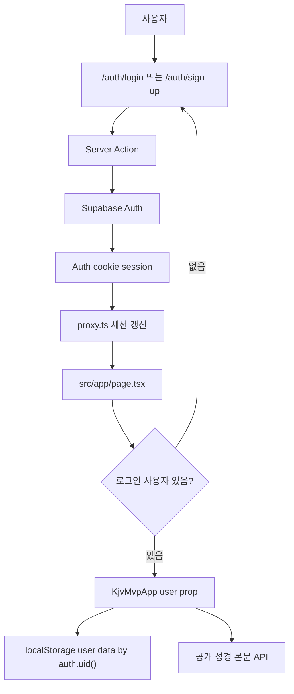

# Supabase 이메일 로그인 구현 아키텍처

## Summary

현재 앱은 `demo-user` mock auth와 localStorage 개인 데이터 저장소를 사용한다. 성경 본문 조회는 Supabase REST 기반으로 전환되어 있지만, 로그인 세션과 개인 통독/강조/인용/설정 데이터는 아직 실제 `auth.users`와 연결되어 있지 않다.

이 문서는 mock auth를 Supabase 이메일 로그인으로 교체하는 구현 아키텍처다. 1차 목표는 Supabase Auth 세션을 앱의 사용자 식별자로 만들고, 기존 localStorage 개인 데이터는 `auth.uid()` 기준으로 분리해 안전하게 유지하는 것이다. 개인 데이터의 DB 동기화는 로그인 전환 이후 별도 단계에서 진행한다.

## Current State

- Next.js App Router 기반 앱이다.
- 주요 앱 표면은 `src/components/kjv-mvp-app.tsx`에 있다.
- 현재 로그인은 `src/lib/mock-auth.ts`의 `demoUser`, `isMockAuthenticated`, `setMockAuthenticated`로 처리한다.
- 현재 개인 데이터는 `src/lib/user-data-repository.ts`에서 localStorage에 저장한다.
- localStorage 키는 `userId`를 포함하므로 Supabase `user.id`로 전환할 수 있다.
- 성경 본문 API는 `src/lib/supabase-rest.ts`를 통해 Supabase REST Data API를 호출한다.
- Supabase migration에는 `auth.users(id)`를 참조하는 사용자 테이블과 RLS 정책이 이미 일부 준비되어 있다.

## Source References

- Supabase Auth Next.js quickstart: https://supabase.com/docs/guides/auth/quickstarts/nextjs
- Supabase SSR client setup: https://supabase.com/docs/guides/auth/server-side/creating-a-client
- Supabase server-side auth overview: https://supabase.com/docs/guides/auth/server-side
- Supabase password auth: https://supabase.com/docs/guides/auth/passwords
- Supabase `signInWithPassword`: https://supabase.com/docs/reference/javascript/auth-signinwithpassword

확인일: 2026-06-23

## Goals

- Supabase 이메일/비밀번호 기반 로그인과 회원가입을 구현한다.
- Next.js App Router에서 Supabase 세션을 쿠키 기반으로 유지한다.
- 새로고침 후에도 로그인 상태가 유지된다.
- 앱 내부 사용자 식별자를 `demo-user`에서 Supabase `auth.users.id`로 전환한다.
- 기존 localStorage 데이터는 삭제하지 않고, 로그인 사용자별로 분리한다.
- 운영 빌드에서는 mock auth 경로가 노출되지 않게 한다.
- DB 개인 데이터 전환 시 RLS의 `auth.uid() = user_id` 모델로 자연스럽게 이어지게 한다.

## Non-goals

- Google/GitHub 등 OAuth provider 로그인
- 패스워드리스 magic link 전용 로그인
- MFA
- 관리자 계정/권한 모델
- 개인 데이터 전체 DB 동기화 즉시 구현
- 성경전서 seed 또는 번역 파이프라인 변경
- Supabase service role key를 클라이언트에서 사용하는 구조

## Target Auth Model

로그인 방식은 이메일/비밀번호를 기본값으로 한다.

- 회원가입: `supabase.auth.signUp({ email, password, options })`
- 로그인: `supabase.auth.signInWithPassword({ email, password })`
- 로그아웃: `supabase.auth.signOut()`
- 비밀번호 재설정: `supabase.auth.resetPasswordForEmail(email, { redirectTo })`
- 서버 보호 판단: 서버 코드에서 `getSession()`만 신뢰하지 않고 Supabase 권장 방식에 따라 토큰 검증 기반 API를 사용한다.

이메일 confirmation은 Supabase 프로젝트 설정을 따른다.

- hosted Supabase 기본값은 이메일 확인 필요 상태로 운영될 수 있다.
- local/self-hosted 개발 환경은 확인 설정이 다를 수 있으므로 구현은 두 흐름을 모두 처리한다.
- 가입 후 즉시 세션이 없으면 “확인 메일을 확인하세요” 상태를 보여준다.

## Environment

필수 환경 변수:

```env
NEXT_PUBLIC_SUPABASE_URL=https://<project-ref>.supabase.co
NEXT_PUBLIC_SUPABASE_PUBLISHABLE_KEY=sb_publishable_...
```

전환 호환 변수:

```env
NEXT_PUBLIC_SUPABASE_ANON_KEY=<legacy anon key>
```

원칙:

- 신규 Auth 클라이언트는 publishable key를 우선 사용한다.
- 현재 성경 REST 조회가 legacy anon key를 사용하므로, 전환 기간에는 `NEXT_PUBLIC_SUPABASE_PUBLISHABLE_KEY`와 `NEXT_PUBLIC_SUPABASE_ANON_KEY`를 병행 지원할 수 있다.
- `service_role` 또는 secret key는 브라우저에 노출되는 `NEXT_PUBLIC_` 변수로 절대 두지 않는다.
- 서버 전용 secret key가 필요해지는 작업은 개인 데이터 DB repository 전환 단계에서 별도 설계한다.

## Proposed File Structure

```txt
src/
  app/
    auth/
      login/page.tsx
      sign-up/page.tsx
      reset-password/page.tsx
      update-password/page.tsx
      callback/route.ts
      actions.ts
    page.tsx
  components/
    auth/
      email-auth-form.tsx
      auth-status-panel.tsx
    kjv-mvp-app.tsx
  lib/
    auth/
      app-user.ts
      local-user-data-migration.ts
    supabase/
      client.ts
      server.ts
      proxy.ts
proxy.ts
```

## Runtime Architecture



## Session Strategy

Next.js App Router에서는 Supabase SSR 클라이언트를 분리한다.

- `src/lib/supabase/client.ts`
  - Client Component에서 사용하는 browser client
  - 로그인 폼의 즉시 UX, auth state subscription, 클라이언트 액션에 사용 가능
- `src/lib/supabase/server.ts`
  - Server Component, Server Action, Route Handler에서 사용하는 server client
  - cookies 기반 세션 접근
- `src/lib/supabase/proxy.ts`
  - 만료된 토큰 refresh
  - request/response cookie 동기화
- `proxy.ts`
  - Next.js 요청 경계에서 `updateSession(request)` 호출

권장 방향:

- 보호가 필요한 서버 경로에서는 cookie에 있는 세션 객체만 신뢰하지 않는다.
- 서버 권한 판단은 Supabase가 검증한 user/claims 결과를 사용한다.
- 클라이언트는 로그인 UI 상태를 표시할 수 있지만, 데이터 소유권 보장은 서버/RLS가 담당한다.

## App Integration

현재 `KjvMvpApp`는 내부에서 mock 로그인 상태를 직접 관리한다. Supabase 전환 후에는 앱 컴포넌트가 인증 공급자를 직접 알지 않도록 바꾼다.

권장 타입:

```ts
type AppUser = {
  id: string
  email: string
  displayName: string
}
```

변경 방향:

- `demoUser` import 제거
- `KjvMvpApp({ user }: { user: AppUser })` 형태로 변경
- `loadUserData(user.id)` 사용
- `saveUserData(user.id, userData)` 사용
- `clearUserData(user.id)` 사용
- 헤더의 사용자 표시는 `user.email` 또는 profile display name 사용
- 로그아웃은 Server Action 또는 Supabase client signOut 후 `/auth/login`으로 이동

`src/app/page.tsx` 책임:

- server client로 현재 사용자를 확인한다.
- 사용자가 없으면 로그인 화면 또는 `/auth/login`으로 보낸다.
- 사용자가 있으면 `AppUser`로 매핑해 `KjvMvpApp`에 전달한다.

## Login UX

### 로그인 페이지

필드:

- 이메일
- 비밀번호

액션:

- 로그인
- 회원가입으로 이동
- 비밀번호 재설정으로 이동

동작:

- 실패 메시지는 계정 존재 여부를 노출하지 않는 일반 메시지로 표시한다.
- 성공 시 `/`로 이동한다.
- 이미 로그인된 사용자는 `/`로 이동한다.

### 회원가입 페이지

필드:

- 이메일
- 비밀번호
- 비밀번호 확인

동작:

- 가입 성공 후 세션이 있으면 `/`로 이동한다.
- 이메일 확인이 필요한 설정이면 “확인 메일을 보냈습니다” 상태를 표시한다.
- `emailRedirectTo`는 `/auth/callback`을 사용한다.

### 비밀번호 재설정

1차 MVP에서는 요청 화면만 포함한다.

- `/auth/reset-password`: 이메일 입력 후 재설정 메일 발송
- `/auth/update-password`: 이메일 링크로 돌아온 사용자가 새 비밀번호 입력

## Local Data Migration

Supabase Auth 전환 직후 개인 데이터 DB 저장소를 바로 구현하지 않는 경우, 기존 localStorage 데이터를 안전하게 옮기는 흐름이 필요하다.

현재 키 모델:

```txt
<APP_SLUG>:v0:user-data:demo-user
<APP_SLUG>:v0:user-data:<supabase-auth-user-id>
```

권장 마이그레이션:

1. 로그인 후 `auth.uid()` 기준 localStorage 데이터를 조회한다.
2. 해당 사용자 데이터가 비어 있고 `demo-user` 데이터가 있으면 가져오기 안내를 표시한다.
3. 사용자가 동의하면 `demo-user` 데이터를 현재 `auth.uid()` 키로 복사한다.
4. 원본 `demo-user` 데이터는 즉시 삭제하지 않는다.
5. 가져오기 완료 플래그를 사용자별 localStorage에 저장해 반복 안내를 막는다.

자동 복사 대신 사용자 동의를 권장하는 이유:

- 같은 브라우저에서 여러 계정이 로그인할 수 있다.
- demo 데이터가 실제 사용자 데이터인지 확정할 수 없다.
- 잘못된 계정에 학습 기록을 붙이는 것을 막아야 한다.

## Personal Data DB Transition

로그인 전환 후에도 개인 데이터는 한동안 localStorage에 남길 수 있다. DB 전환 시에는 기존 migration과 현재 FE 데이터 모델의 차이를 먼저 보완해야 한다.

이미 있는 테이블:

- `user_reading_positions`
- `user_completed_chapters`
- `user_highlights`
- `user_favorite_verses`
- `user_tags`
- `user_favorite_verse_tags`
- `user_highlight_tags`
- `user_settings`
- `user_tts_sessions`

현재 FE 기능 기준 추가 검토가 필요한 테이블:

- `user_favorite_lists`
- `user_favorite_verse_list_memberships`
- `user_study_notes`
- `user_reading_plans`

DB 전환 원칙:

- 모든 개인 데이터 row는 `user_id uuid not null references auth.users(id)`를 가진다.
- exposed schema의 개인 데이터 테이블은 RLS를 활성화한다.
- 기본 정책은 `auth.uid() = user_id`이다.
- 다대다 membership 테이블은 부모 row의 `user_id`를 검증하는 RLS를 둔다.
- user-editable metadata를 권한 판단에 사용하지 않는다.

## Security Requirements

- 브라우저 번들에 service role 또는 secret key를 포함하지 않는다.
- 서버 보호 로직에서 `getSession()`만으로 사용자를 신뢰하지 않는다.
- RLS 정책은 migration에 남긴다. Dashboard에서만 수정하지 않는다.
- 이메일 로그인 에러는 계정 존재 여부를 구분해서 노출하지 않는다.
- 비밀번호 정책은 Supabase password settings에서 최소 길이와 유출 비밀번호 방어 옵션을 검토한다.
- 가입/재설정 redirect URL은 Supabase Dashboard Auth URL 설정에 등록한다.
- 운영 배포 전 Site URL과 Redirect URL에 production domain, preview domain, localhost를 구분해 등록한다.
- 개인 데이터 보안 정책은 [user-data-security-management-policy.md](./user-data-security-management-policy.md)를 따른다.

## Implementation Phases

### Phase A-01: Supabase Auth 기반 준비

작업 체크리스트:

- [ ] `@supabase/supabase-js`와 `@supabase/ssr`를 설치한다.
- [ ] `NEXT_PUBLIC_SUPABASE_URL`을 정리한다.
- [ ] `NEXT_PUBLIC_SUPABASE_PUBLISHABLE_KEY`를 추가한다.
- [ ] 기존 `NEXT_PUBLIC_SUPABASE_ANON_KEY` 사용 위치를 확인한다.
- [ ] Supabase Dashboard에서 Email provider 활성 상태를 확인한다.
- [ ] Site URL과 Redirect URL을 등록한다.

수용 기준:

- [ ] 브라우저 client와 server client가 같은 프로젝트를 바라본다.
- [ ] secret/service role key가 클라이언트 환경 변수에 없다.

### Phase A-02: SSR Supabase Client와 Proxy

작업 체크리스트:

- [ ] `src/lib/supabase/client.ts`를 추가한다.
- [ ] `src/lib/supabase/server.ts`를 추가한다.
- [ ] `src/lib/supabase/proxy.ts`를 추가한다.
- [ ] root `proxy.ts`에서 세션 갱신을 연결한다.
- [ ] Next.js App Router 서버 코드에서 현재 사용자 조회 helper를 만든다.

수용 기준:

- [ ] 새로고침 후 세션이 유지된다.
- [ ] 만료 토큰 refresh가 cookie에 반영된다.

### Phase A-03: Email Auth UI와 Actions

작업 체크리스트:

- [ ] `/auth/login` 페이지를 만든다.
- [ ] `/auth/sign-up` 페이지를 만든다.
- [ ] `/auth/callback` route handler를 만든다.
- [ ] `/auth/reset-password` 페이지를 만든다.
- [ ] `/auth/update-password` 페이지를 만든다.
- [ ] `actions.ts`에 sign in, sign up, sign out, reset password, update password server action을 둔다.
- [ ] 로그인 실패/가입 확인/재설정 완료 상태 메시지를 정리한다.

수용 기준:

- [ ] 이메일/비밀번호로 가입할 수 있다.
- [ ] 이메일 확인이 필요한 경우 안내 상태가 표시된다.
- [ ] 기존 계정으로 로그인할 수 있다.
- [ ] 로그아웃 후 보호 화면에 접근할 수 없다.

### Phase A-04: App Auth Boundary 교체

작업 체크리스트:

- [ ] `AppUser` 타입을 추가한다.
- [ ] `KjvMvpApp`이 `user` prop을 받게 한다.
- [ ] `demoUser.id` 사용을 `user.id`로 교체한다.
- [ ] header 사용자 표시를 Supabase user email 기반으로 바꾼다.
- [ ] mock login button을 운영 UI에서 제거한다.
- [ ] dev-only mock auth가 필요하면 명시적 feature flag 뒤로 숨긴다.

수용 기준:

- [ ] 로그인한 사용자만 앱 본 화면에 접근한다.
- [ ] localStorage 데이터가 Supabase user id별로 분리된다.
- [ ] 운영 환경에서 `?mockAuth=1`로 로그인 우회가 되지 않는다.

### Phase A-05: Local Data Import

작업 체크리스트:

- [ ] `demo-user` localStorage 데이터 감지 helper를 만든다.
- [ ] 첫 로그인 사용자에게 기존 로컬 기록 가져오기 UI를 보여준다.
- [ ] 가져오기 동의 시 auth user id 키로 데이터를 복사한다.
- [ ] 가져오기 완료 플래그를 저장한다.
- [ ] 계정 전환 시 다른 사용자의 localStorage를 읽지 않는지 확인한다.

수용 기준:

- [ ] 기존 demo 기록이 사라지지 않는다.
- [ ] 사용자가 동의하면 현재 계정 데이터로 복사된다.
- [ ] 두 Supabase 계정의 개인 데이터가 섞이지 않는다.

### Phase A-06: Personal Data Repository 전환

이 단계는 로그인 구현 이후 별도 작업으로 진행한다.

작업 체크리스트:

- [ ] 현재 FE `UserDataState`와 DB user tables 차이를 매핑한다.
- [ ] 누락 테이블 migration을 추가한다.
- [ ] RLS와 grant를 migration으로 추가한다.
- [ ] `UserDataRepository` 인터페이스를 localStorage/DB 구현으로 분리한다.
- [ ] 로그인 사용자는 DB repository, dev fallback은 localStorage repository를 사용하게 한다.
- [ ] 기존 localStorage 데이터를 DB로 업로드하는 one-time migration을 설계한다.

수용 기준:

- [ ] RLS가 사용자별 데이터 분리를 보장한다.
- [ ] 새로고침과 다른 기기 로그인 후에도 개인 데이터가 동기화된다.
- [ ] localStorage fallback 없이도 핵심 흐름이 동작한다.

## Test Plan

자동 검증:

- [ ] `npm run lint`
- [ ] `npm run build`
- [ ] `npm audit --audit-level=moderate`

Auth 수동 검증:

- [ ] 새 이메일로 회원가입한다.
- [ ] 이메일 확인이 필요한 설정에서 확인 안내가 표시된다.
- [ ] 확인 링크를 통해 `/auth/callback`으로 돌아온다.
- [ ] 기존 계정으로 로그인한다.
- [ ] 새로고침 후 로그인 상태가 유지된다.
- [ ] 로그아웃 후 앱 본 화면에 접근할 수 없다.
- [ ] 잘못된 비밀번호에서 계정 존재 여부가 노출되지 않는다.
- [ ] 비밀번호 재설정 메일을 요청할 수 있다.

데이터 분리 검증:

- [ ] 계정 A에서 읽기 위치를 저장한다.
- [ ] 로그아웃 후 계정 B로 로그인한다.
- [ ] 계정 A의 localStorage 데이터가 계정 B 화면에 보이지 않는다.
- [ ] 계정 A로 다시 로그인하면 계정 A 데이터가 복원된다.
- [ ] demo 데이터 가져오기 후 원본 demo 데이터는 보존된다.

보안 검증:

- [ ] 클라이언트 번들 또는 `NEXT_PUBLIC_` 환경 변수에 service role/secret key가 없다.
- [ ] Supabase Auth redirect URL이 localhost, preview, production에 맞게 등록되어 있다.
- [ ] 개인 데이터 DB repository 전환 전까지는 RLS 테이블을 직접 쓰지 않는다.
- [ ] DB repository 전환 시 `auth.uid() = user_id` 정책으로 CRUD smoke test를 실행한다.

## Open Decisions

- 이메일 로그인은 이메일/비밀번호를 기본으로 한다. Magic link만 쓰려면 `signInWithOtp` 중심으로 별도 UX를 잡아야 한다.
- 가입을 앱에서 열어둘지, 초대/관리자 생성 계정만 허용할지 결정해야 한다.
- 이메일 확인 필수 여부를 운영 정책으로 확정해야 한다.
- demo localStorage 데이터를 자동 가져오기할지, 사용자 확인 후 가져오기할지 최종 결정해야 한다. 권장은 사용자 확인 후 가져오기다.
- `NEXT_PUBLIC_SUPABASE_ANON_KEY`를 언제 `NEXT_PUBLIC_SUPABASE_PUBLISHABLE_KEY` 중심으로 완전히 정리할지 결정해야 한다.

## Done Definition

- [ ] mock auth 없이 Supabase 이메일 로그인으로 앱에 진입한다.
- [ ] 세션은 cookie 기반으로 새로고침 후 유지된다.
- [ ] 로그인 사용자 id가 앱 개인 데이터 key로 사용된다.
- [ ] 운영 환경에서 mock auth 우회가 불가능하다.
- [ ] 기존 demo localStorage 데이터 보존/가져오기 정책이 구현되어 있다.
- [ ] lint, build, audit가 통과한다.
- [ ] 회원가입, 로그인, 로그아웃, 새로고침, 계정별 데이터 분리를 브라우저에서 검증했다.
