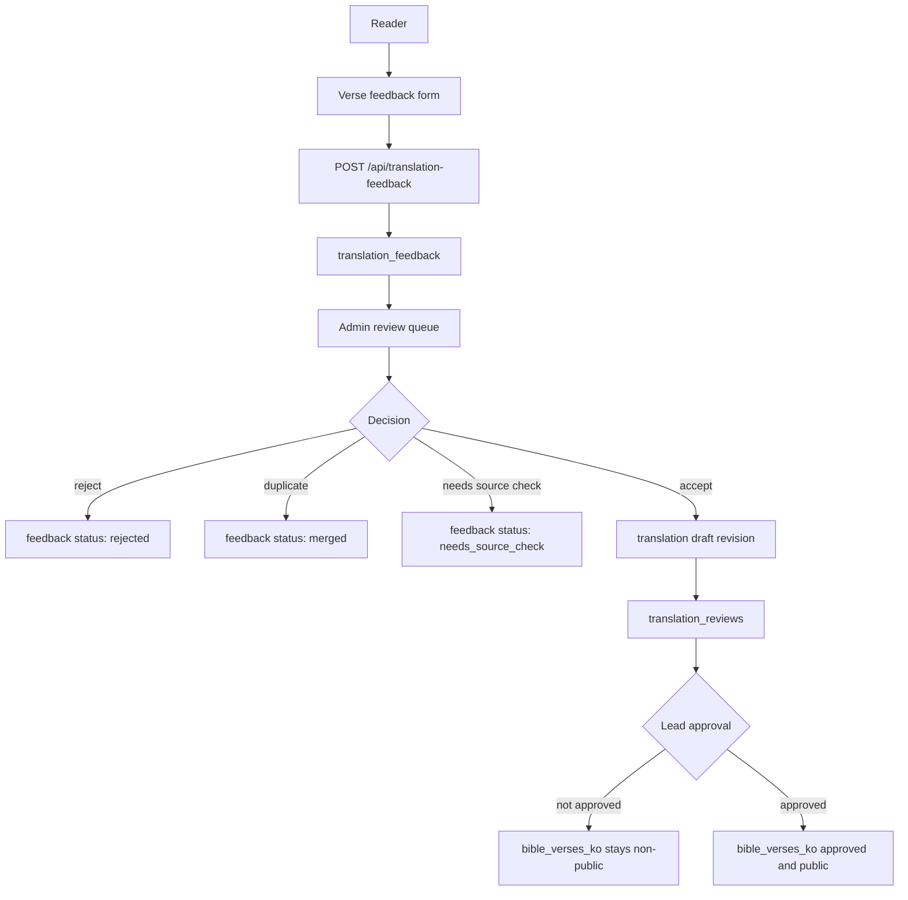

# 번역 피드백 폼, 어드민 리뷰 큐, RBAC 아키텍처

## Summary

KJV Educator는 현재 Supabase Auth 기반 로그인, 공개 KJV 본문 조회, 승인된 한국어 번역 조회, `translation_reviews` 기반 번역 수정 이력을 갖고 있다. 다음 단계에서는 독자가 구절 단위 번역 오류를 제보하고, 내부 검수자가 어드민 리뷰 큐에서 확인한 뒤, 승인된 수정만 공개 번역에 반영하는 구조가 필요하다.

이 문서는 피드백 제출 폼, 어드민 리뷰 큐, 번역 반영 워크플로, RBAC 권한 체계, Supabase RLS 정책 방향을 함께 정의한다.

## Source References

기존 저장소 문서와 구현:

- `docs/translation-review-workflow.md`
- `docs/translation-style-guide.md`
- `docs/db-load-phases/phase-07-korean-translation-pipeline.md`
- `docs/mvp-phases/user-data-security-management-policy.md`
- `supabase/migrations/003_create_bible_verses_ko.sql`
- `supabase/migrations/004_create_translation_terms_and_reviews.sql`
- `supabase/migrations/007_create_rls_policies.sql`
- `src/app/page.tsx`
- `src/lib/supabase/server.ts`

Supabase 공식 문서:

- Row Level Security: https://supabase.com/docs/guides/database/postgres/row-level-security
- Custom claims and RBAC: https://supabase.com/docs/guides/api/custom-claims-and-role-based-access-control-rbac
- Custom Access Token Hook: https://supabase.com/docs/guides/auth/auth-hooks/custom-access-token-hook
- SSR auth client: https://supabase.com/docs/guides/auth/server-side/creating-a-client
- `getClaims`: https://supabase.com/docs/reference/javascript/auth-getclaims
- `getUser`: https://supabase.com/docs/reference/javascript/auth-getuser

확인일: 2026-06-23

## Current State

- 앱 진입은 `src/app/page.tsx`에서 `supabase.auth.getUser()`로 로그인 사용자를 확인한다.
- 성경 본문 API는 공개 KJV와 `translation_status='approved'`, `is_public=true`인 한국어 번역만 반환한다.
- `bible_verses_ko`는 자체 한국어 번역 row와 공개 상태를 관리한다.
- `translation_terms`는 KJV-to-Korean 용어 사전이다.
- `translation_reviews`는 검수자가 실제 번역을 수정하거나 승인한 이력이다.
- 사용자 피드백 제출 큐와 어드민 권한 모델은 아직 없다.

중요한 구분:

- `translation_feedback`: 독자가 제출한 문제 제보와 검토 큐.
- `translation_reviews`: 내부 검수자가 실제 번역 row를 수정하거나 승인한 감사 이력.

피드백이 접수됐다고 곧바로 본문이 바뀌면 안 된다. 피드백은 큐에 쌓이고, 내부 검수자가 반영한 경우에만 `translation_reviews`와 연결된다.

## Goals

- 독자가 구절 단위로 오역, 사전 의미 혼용, 어색한 표현, 신학 용어 문제를 제보할 수 있다.
- 피드백 제출 시 구절, 원문, 현재 번역, 선택 표현, 번역 상태 snapshot을 자동 저장한다.
- 어드민 리뷰 큐에서 상태, 우선순위, 담당자, 중복 여부, 내부 메모를 관리한다.
- 검수자는 피드백을 근거로 번역 수정안을 작성하고 `translation_reviews`에 이력을 남긴다.
- 최종 승인 권한자만 `bible_verses_ko.translation_status='approved'`, `is_public=true`로 공개할 수 있다.
- 일반 사용자는 본인 피드백만 볼 수 있고, 어드민 큐와 내부 메모는 볼 수 없다.
- 권한 판단은 user-editable metadata가 아니라 서버 검증 사용자와 DB/RLS/RBAC 정책에 둔다.

## Non-goals

- 커뮤니티 공개 토론 게시판
- 익명 피드백 수집
- 자동 번역 수정 반영
- 외부 한국어 성경 번역문 복사 기반 검수
- 전체 CMS 또는 범용 관리자 도구
- 관리자 MFA 구현
- 알림 이메일 자동화

## Role Model

초기 RBAC는 역할을 적게 두고, 권한은 명시적으로 분리한다.

| 역할 | 대상 | 핵심 권한 |
| --- | --- | --- |
| `reader` | 로그인한 일반 사용자 | 공개 본문 조회, 본인 피드백 제출, 본인 피드백 상태 조회 |
| `feedback_reviewer` | 1차 검수자 | 모든 피드백 조회, 상태/우선순위/담당자/내부 메모 관리, 중복 병합 |
| `translator` | 번역 수정자 | 피드백 기반 수정안 작성, `translation_reviews` revision 이력 생성, 비공개 번역 row 수정 |
| `lead_reviewer` | 최종 승인자 | 수정안 최종 승인, 한국어 번역 공개 전환, 반려 확정 |
| `admin` | 운영 관리자 | 사용자 역할 부여/회수, 큐 운영 설정, 감사 로그 조회 |
| `service_role` | 서버 전용 시스템 | 마이그레이션, seed, 관리자 역할 변경 같은 서버 전용 작업 |

권장 정책:

- 한 사용자가 여러 역할을 가질 수 있다.
- `admin`은 역할 관리 권한을 갖지만, 번역 공개 승인은 `lead_reviewer` 권한으로 따로 검사한다.
- `translator`가 본인이 수정한 건을 바로 승인하지 못하게 하는 two-person rule은 Phase F-04에서 서버 액션 검증으로 적용한다.

## Permission Matrix

| 기능 | reader | feedback_reviewer | translator | lead_reviewer | admin |
| --- | --- | --- | --- | --- | --- |
| 공개 본문 조회 | O | O | O | O | O |
| 본인 피드백 제출 | O | O | O | O | O |
| 본인 피드백 조회 | O | O | O | O | O |
| 전체 피드백 큐 조회 | X | O | O | O | O |
| 피드백 상태 변경 | X | O | O | O | O |
| 피드백 중복 병합 | X | O | O | O | O |
| 내부 검토 메모 작성 | X | O | O | O | O |
| 번역 수정안 작성 | X | X | O | O | X |
| `translation_reviews` revision 생성 | X | X | O | O | X |
| 승인본 공개 전환 | X | X | X | O | X |
| 역할 부여/회수 | X | X | X | X | O |
| 감사 로그 조회 | X | 제한 | 제한 | O | O |

## Target Runtime Flow



## Feedback Form UX

구절 옆 메뉴 또는 한국어 번역 표시 영역에 `번역 의견` 액션을 둔다. 폼이 열릴 때 앱이 자동으로 snapshot을 채운다.

자동 수집:

- `verse_key`
- `book_order`, `chapter`, `verse`
- KJV 원문 snapshot
- 현재 한국어 번역 snapshot
- `translation_name`
- `translation_status`
- `ko_verse_id`
- 선택한 표현 또는 드래그한 텍스트
- 관련 `translation_terms.id`, `kjv_term`, `ko_term` 후보

사용자 입력:

- 문제 유형
- 문제가 되는 표현
- 더 적절한 번역 제안
- 선택 설명

문제 유형:

```ts
type TranslationFeedbackIssueType =
  | "wrong_meaning"
  | "dictionary_sense_mismatch"
  | "awkward_expression"
  | "theological_term"
  | "typo_or_grammar"
  | "other";
```

사용자에게 보이는 문구:

```text
이 번역이 문맥과 다르거나 단어 뜻이 잘못 선택된 것 같다면 알려주세요.
가능하면 더 적절한 표현도 함께 제안해 주세요.
```

UX 원칙:

- 일반 사용자에게 `오역`, `의역`, `사전 의미 혼용`을 강제로 구분시키지 않는다.
- 선택지는 짧고, 내부 데이터는 구조화해서 저장한다.
- `신고`보다 `번역 의견`이라는 용어를 사용한다.
- 제출 후에는 "접수됨", "검토 중", "반영됨", "반려됨" 정도의 상태만 보여준다.
- 내부 메모, 담당자, 관리자 판단 근거는 일반 사용자에게 노출하지 않는다.

## Admin Review Queue UX

경로:

- `/admin`
- `/admin/translation-feedback`
- `/admin/translation-feedback/[feedbackId]`
- `/admin/translation-terms`
- `/admin/users/roles`

목록 컬럼:

- 구절: `GEN.1.1`
- 문제 유형
- 선택 표현
- 상태
- 우선순위
- 중복 수
- 담당자
- 제출자
- 제출일
- 마지막 변경일

필터:

- 상태
- 문제 유형
- 성경 권/장
- 담당자
- 우선순위
- 중복/병합 여부
- `needs_source_check`
- 내가 담당한 항목

상세 화면:

- KJV 원문 snapshot
- 현재 DB의 KJV 원문
- 제출 당시 한국어 번역 snapshot
- 현재 DB의 한국어 번역
- 선택 표현과 사용자 제안 번역
- 관련 용어 사전 row
- 같은 구절의 기존 피드백
- 같은 구절의 `translation_reviews` 이력
- 내부 검토 메모
- 상태 변경 타임라인

주요 액션:

- `triage`: 상태를 `triaged` 또는 `reviewing`으로 변경
- `assign`: 담당자 지정
- `mark_duplicate`: 기존 피드백에 병합
- `needs_source_check`: KJV 원문/용어 사전 재확인 필요 표시
- `reject`: 반려 사유 기록
- `accept`: 번역 수정안 작성 단계로 전환
- `apply_revision`: `bible_verses_ko` 수정 및 `translation_reviews` 생성
- `approve_publication`: 최종 승인 및 공개 전환

## Database Architecture

### RBAC Tables

역할 source of truth는 사용자가 수정할 수 없는 DB 테이블에 둔다. `raw_user_meta_data` 또는 `user_metadata`는 권한 판단에 사용하지 않는다.

```sql
create schema if not exists app_private;

create table app_private.user_roles (
  user_id uuid not null references auth.users(id) on delete cascade,
  role text not null check (
    role in (
      'feedback_reviewer',
      'translator',
      'lead_reviewer',
      'admin'
    )
  ),
  assigned_by uuid references auth.users(id) on delete set null,
  assigned_at timestamptz not null default now(),
  expires_at timestamptz,
  primary key (user_id, role)
);
```

권한 확장성이 필요하면 `app_private.roles`, `app_private.permissions`, `app_private.role_permissions`로 정규화한다. MVP에서는 역할 enum과 helper function으로 충분하다.

권장 helper:

```sql
create or replace function app_private.has_role(required_role text)
returns boolean
language sql
stable
security definer
set search_path = app_private, public
as $$
  select exists (
    select 1
    from app_private.user_roles role_row
    where role_row.user_id = (select auth.uid())
      and role_row.role = required_role
      and (role_row.expires_at is null or role_row.expires_at > now())
  );
$$;
```

주의:

- `security definer` 함수는 exposed schema인 `public`에 두지 않는다.
- 역할 관리 API는 서버 전용으로 만들고, service role key는 브라우저에 노출하지 않는다.
- JWT custom claim을 쓰는 경우 역할 변경은 토큰 refresh 전까지 stale할 수 있다. 관리자 권한 회수 시 세션 revoke 또는 짧은 JWT 만료 시간을 함께 운영한다.

### Feedback Tables

```sql
create table public.translation_feedback (
  id uuid primary key default gen_random_uuid(),
  submitted_by uuid not null references auth.users(id) on delete cascade,
  verse_key text not null,
  en_verse_id uuid references public.bible_verses_en(id) on delete set null,
  ko_verse_id uuid references public.bible_verses_ko(id) on delete set null,
  book_order int not null check (book_order between 1 and 66),
  chapter int not null check (chapter > 0),
  verse int not null check (verse > 0),
  kjv_text_snapshot text not null,
  ko_text_snapshot text not null,
  translation_name text not null,
  translation_status_snapshot text not null,
  selected_text text,
  term_id uuid references public.translation_terms(id) on delete set null,
  issue_type text not null check (
    issue_type in (
      'wrong_meaning',
      'dictionary_sense_mismatch',
      'awkward_expression',
      'theological_term',
      'typo_or_grammar',
      'other'
    )
  ),
  suggested_text text,
  user_comment text,
  status text not null default 'new' check (
    status in (
      'new',
      'triaged',
      'reviewing',
      'needs_source_check',
      'accepted',
      'rejected',
      'merged',
      'implemented'
    )
  ),
  priority text not null default 'normal' check (
    priority in ('low', 'normal', 'high', 'blocker')
  ),
  assigned_to uuid references auth.users(id) on delete set null,
  duplicate_of uuid references public.translation_feedback(id) on delete set null,
  reviewed_by uuid references auth.users(id) on delete set null,
  reviewed_at timestamptz,
  reviewer_note text,
  created_at timestamptz not null default now(),
  updated_at timestamptz not null default now()
);

create index translation_feedback_queue_idx
on public.translation_feedback(status, priority, created_at desc);

create index translation_feedback_verse_idx
on public.translation_feedback(verse_key, status, created_at desc);

create index translation_feedback_submitter_idx
on public.translation_feedback(submitted_by, created_at desc);
```

### Feedback Events

상태 변경과 내부 코멘트는 append-only event로 남긴다.

```sql
create table public.translation_feedback_events (
  id uuid primary key default gen_random_uuid(),
  feedback_id uuid not null references public.translation_feedback(id) on delete cascade,
  actor_id uuid references auth.users(id) on delete set null,
  event_type text not null check (
    event_type in (
      'submitted',
      'triaged',
      'assigned',
      'status_changed',
      'commented',
      'merged',
      'accepted',
      'rejected',
      'revision_linked',
      'implemented'
    )
  ),
  from_status text,
  to_status text,
  note text,
  metadata jsonb not null default '{}'::jsonb,
  created_at timestamptz not null default now()
);

create index translation_feedback_events_feedback_idx
on public.translation_feedback_events(feedback_id, created_at asc);
```

### Revision Link

기존 `translation_reviews`는 그대로 번역 변경 이력 역할을 유지한다. 피드백 기반 수정만 연결 테이블로 묶는다.

```sql
create table public.translation_feedback_review_links (
  feedback_id uuid not null references public.translation_feedback(id) on delete cascade,
  review_id uuid not null references public.translation_reviews(id) on delete cascade,
  linked_by uuid references auth.users(id) on delete set null,
  linked_at timestamptz not null default now(),
  primary key (feedback_id, review_id)
);
```

## RLS And Grants

기본 원칙:

- exposed schema의 새 테이블은 모두 RLS를 활성화한다.
- 일반 사용자는 본인 피드백만 `select`할 수 있다.
- 일반 사용자는 피드백을 `insert`할 수 있지만 상태/담당자/내부 메모를 임의 지정할 수 없어야 한다.
- 관리자 큐 조회와 수정은 역할 helper로 제한한다.
- 관리자 페이지가 서버 route/action을 사용하더라도 DB RLS가 최종 방어선이어야 한다.

권장 정책 예시:

```sql
alter table public.translation_feedback enable row level security;
alter table public.translation_feedback_events enable row level security;
alter table public.translation_feedback_review_links enable row level security;

grant select, insert on public.translation_feedback to authenticated;
grant select, insert on public.translation_feedback_events to authenticated;
grant select, insert on public.translation_feedback_review_links to authenticated;

create policy "Users can read own feedback"
on public.translation_feedback
for select
to authenticated
using (
  submitted_by = (select auth.uid())
  or app_private.has_role('feedback_reviewer')
  or app_private.has_role('translator')
  or app_private.has_role('lead_reviewer')
  or app_private.has_role('admin')
);

create policy "Users can submit feedback"
on public.translation_feedback
for insert
to authenticated
with check (
  submitted_by = (select auth.uid())
  and status = 'new'
  and priority = 'normal'
  and assigned_to is null
  and duplicate_of is null
  and reviewed_by is null
  and reviewed_at is null
  and reviewer_note is null
);

create policy "Reviewers can update feedback queue"
on public.translation_feedback
for update
to authenticated
using (
  app_private.has_role('feedback_reviewer')
  or app_private.has_role('translator')
  or app_private.has_role('lead_reviewer')
  or app_private.has_role('admin')
)
with check (
  app_private.has_role('feedback_reviewer')
  or app_private.has_role('translator')
  or app_private.has_role('lead_reviewer')
  or app_private.has_role('admin')
);
```

Column-level grant를 함께 사용해 일반 사용자가 insert 가능한 컬럼을 제한하는 것을 권장한다. RLS는 row 조건이고, 컬럼 단위 쓰기 제한은 grant로 보강해야 한다.

`bible_verses_ko` 보강 정책:

- public/anon은 기존처럼 승인된 row만 읽는다.
- `feedback_reviewer`, `translator`, `lead_reviewer`는 비공개 번역 row도 읽을 수 있다.
- `translator`는 비공개 row의 `text_ko`, `translation_status`, `reviewer_note` 수정만 가능해야 한다.
- `lead_reviewer`만 `approved`와 `is_public=true` 전환을 할 수 있다.
- `approved` 공개 전환은 서버 액션에서 `translation_reviews` row 생성과 같은 트랜잭션으로 처리한다.

`translation_reviews` 보강 정책:

- 일반 사용자는 직접 조회하지 않는다.
- 검수 역할은 관련 이력을 조회할 수 있다.
- `translator`와 `lead_reviewer`만 insert할 수 있다.
- `review_status='approved'`는 `lead_reviewer`만 insert할 수 있다.

## API Architecture

Reader API:

- `POST /api/translation-feedback`
  - auth required
  - request body는 사용자 입력만 받는다.
  - 서버가 `verse_key` 기준으로 현재 KJV/한국어 snapshot을 재조회한다.
  - 서버가 `submitted_by`, 상태 기본값, snapshot을 구성한다.
  - 제출 성공 후 `translation_feedback_events.submitted`를 생성한다.

- `GET /api/translation-feedback/mine`
  - auth required
  - 본인 피드백 상태 목록만 반환한다.
  - 내부 메모와 관리자 전용 필드는 제외한다.

Admin API:

- `GET /api/admin/translation-feedback`
  - `feedback_reviewer` 이상 필요
  - 필터, 정렬, pagination 지원

- `GET /api/admin/translation-feedback/[feedbackId]`
  - `feedback_reviewer` 이상 필요
  - snapshot, 현재 본문, 관련 terms, 관련 feedback, review history 반환

- `PATCH /api/admin/translation-feedback/[feedbackId]`
  - `feedback_reviewer` 이상 필요
  - 상태, 우선순위, 담당자, 내부 메모 변경
  - event append

- `POST /api/admin/translation-feedback/[feedbackId]/apply-revision`
  - `translator` 또는 `lead_reviewer` 필요
  - `bible_verses_ko` 수정
  - `translation_reviews.review_status='revised'` 생성
  - feedback status를 `accepted` 또는 `implemented`로 전환
  - link row 생성

- `POST /api/admin/translation-feedback/[feedbackId]/approve-publication`
  - `lead_reviewer` 필요
  - two-person rule 검사
  - `translation_reviews.review_status='approved'` 생성
  - `bible_verses_ko.translation_status='approved'`, `is_public=true` 전환

- `POST /api/admin/users/[userId]/roles`
  - `admin` 필요
  - 역할 부여/회수
  - service role server client만 사용
  - role audit event 기록

서버 인증 원칙:

- 보호 route/action은 Supabase SSR server client로 현재 사용자를 검증한다.
- 단순 표시에는 `getClaims()`를 사용할 수 있지만, 고위험 작업이나 역할 변경은 최신 사용자/역할 상태를 DB에서 다시 확인한다.
- `getSession()` 결과의 user object만으로 권한 판단을 하지 않는다.

## Admin Page Architecture

추천 파일 구조:

```txt
src/
  app/
    admin/
      layout.tsx
      page.tsx
      translation-feedback/
        page.tsx
        [feedbackId]/page.tsx
      translation-terms/
        page.tsx
      users/
        roles/page.tsx
    api/
      translation-feedback/
        route.ts
        mine/route.ts
      admin/
        translation-feedback/
          route.ts
          [feedbackId]/route.ts
          [feedbackId]/apply-revision/route.ts
          [feedbackId]/approve-publication/route.ts
        users/
          [userId]/roles/route.ts
  components/
    feedback/
      translation-feedback-form.tsx
      feedback-status-list.tsx
    admin/
      admin-shell.tsx
      feedback-queue-table.tsx
      feedback-detail-panel.tsx
      feedback-status-controls.tsx
      translation-diff-view.tsx
      role-assignment-panel.tsx
  lib/
    auth/
      require-admin-role.ts
      rbac.ts
    translation-feedback/
      feedback-repository.ts
      feedback-types.ts
      feedback-validation.ts
```

`/admin/layout.tsx` 책임:

- 로그인 사용자 확인
- 최소 `feedback_reviewer`, `translator`, `lead_reviewer`, `admin` 중 하나가 있는지 확인
- 권한 없으면 404 또는 접근 거부 화면
- 서버에서 사용자 role set을 내려주고, UI는 권한별 액션만 표시

권한 없는 버튼을 숨기는 것은 UX일 뿐이다. 실제 차단은 API route와 RLS에서 한다.

## Status Model

피드백 상태:

```text
new
-> triaged
-> reviewing
-> accepted
-> implemented
```

분기 상태:

```text
new/reviewing -> needs_source_check
new/reviewing -> rejected
new/reviewing -> merged
```

상태 의미:

| 상태 | 의미 |
| --- | --- |
| `new` | 제출 직후, 아직 내부 검토 전 |
| `triaged` | 유형/우선순위/담당자 정리 완료 |
| `reviewing` | 원문/용어/문맥 검토 중 |
| `needs_source_check` | KJV 원문, 용어 사전, 고유명사 기준 재확인 필요 |
| `accepted` | 문제 제보가 타당하다고 판단됨 |
| `rejected` | 반영하지 않기로 결정됨 |
| `merged` | 같은 이슈로 기존 피드백에 병합됨 |
| `implemented` | 번역 row와 `translation_reviews`에 반영 완료 |

본문 번역 상태는 기존 `bible_verses_ko.translation_status`를 유지한다.

```text
draft -> ai_translated -> reviewing -> reviewed -> approved
needs_check는 어느 단계에서든 재검토 상태로 사용
```

## Audit And Privacy

감사 로그:

- 피드백 제출
- 상태 변경
- 담당자 변경
- 중복 병합
- 내부 메모
- 번역 수정 적용
- 최종 승인
- 역할 부여/회수

로그에 남기지 말아야 할 것:

- access token
- refresh token
- service role key
- 비밀번호
- 이메일 확인 링크 전체 URL
- 개인 메모 전문

피드백 본문은 관리자 검토 대상이므로 private data로 취급한다. 일반 사용자 간 공개 피드백 목록은 만들지 않는다.

## Abuse And Quality Controls

- 로그인 사용자만 피드백 제출 가능.
- `POST /api/translation-feedback`에 사용자별 rate limit을 둔다.
- 같은 `verse_key`, 같은 `selected_text`, 같은 `issue_type`의 반복 제출은 중복 후보로 묶는다.
- `suggested_text`와 `user_comment` 길이를 제한한다.
- HTML은 저장하지 않고 plain text만 허용한다.
- 사용자 제안 문구는 외부 번역문 복사 가능성이 있으므로 그대로 본문에 반영하지 않는다.
- 반영 시 검수자가 KJV 원문과 내부 스타일 가이드를 기준으로 새 번역문을 작성한다.

## Implementation Phases

### Phase F-01: Schema And RBAC Foundation

작업 체크리스트:

- [ ] `app_private.user_roles`를 추가한다.
- [ ] `app_private.has_role()` helper를 추가한다.
- [ ] `translation_feedback`을 추가한다.
- [ ] `translation_feedback_events`를 추가한다.
- [ ] `translation_feedback_review_links`를 추가한다.
- [ ] RLS와 grant를 migration에 작성한다.
- [ ] feedback/review/index를 추가한다.
- [ ] 관리자 role seed 또는 수동 bootstrap 절차를 문서화한다.

관리자 role bootstrap 절차:

1. Supabase Dashboard Auth 사용자 목록에서 최초 운영자의 `auth.users.id`를 확인한다.
2. Supabase SQL Editor 또는 service-role만 접근 가능한 배포 작업에서 아래 SQL을 1회 실행한다.

```sql
insert into app_private.user_roles (user_id, role)
values ('<auth.users.id>'::uuid, 'admin')
on conflict (user_id, role) do update
  set assigned_at = now(),
      expires_at = null;
```

3. 이후 역할 부여/회수는 `/admin/users/roles`에서 처리한다. 이 화면은 `public.set_user_app_role()` RPC를 통해 `app_private.user_roles`와 `admin_role_events`를 함께 갱신한다.

수용 기준:

- [ ] 일반 사용자는 본인 feedback만 select할 수 있다.
- [ ] 일반 사용자는 status, priority, reviewer_note를 임의 설정해 insert할 수 없다.
- [ ] `feedback_reviewer`는 전체 queue를 볼 수 있다.
- [ ] 권한 없는 사용자는 queue row를 select/update할 수 없다.
- [ ] RLS가 켜져 있고 필요한 grant만 존재한다.

### Phase F-02: Reader Feedback Form

작업 체크리스트:

- [ ] 구절 메뉴에 `번역 의견` 액션을 추가한다.
- [ ] feedback form component를 만든다.
- [ ] 선택 표현, 문제 유형, 제안 번역, 설명 입력을 받는다.
- [ ] `POST /api/translation-feedback` route를 만든다.
- [ ] 서버가 현재 KJV/KO snapshot을 재조회한다.
- [ ] 제출 성공/실패 상태를 UI에 표시한다.
- [ ] 내 피드백 상태 조회 API를 만든다.

수용 기준:

- [ ] 로그인 사용자가 승인된 한국어 구절에서 feedback을 제출할 수 있다.
- [ ] 제출 row에 snapshot이 저장된다.
- [ ] 승인본이 없는 fallback 영어 구절에서는 한국어 번역 피드백이 비활성화되거나 별도 안내된다.
- [ ] 긴 입력, 빈 제안, 잘못된 issue type이 검증된다.

### Phase F-03: Admin Queue MVP

작업 체크리스트:

- [ ] `/admin/layout.tsx` 권한 boundary를 만든다.
- [ ] queue table을 만든다.
- [ ] 상태/유형/권/장/담당자 필터를 만든다.
- [ ] detail page에서 snapshot과 현재 본문을 비교한다.
- [ ] 상태 변경과 내부 메모 액션을 만든다.
- [ ] event timeline을 표시한다.
- [ ] 중복 후보를 표시한다.

수용 기준:

- [ ] `feedback_reviewer` 이상만 `/admin/translation-feedback`에 접근한다.
- [ ] 권한 없는 사용자는 URL 직접 접근과 API 직접 호출 모두 실패한다.
- [ ] 상태 변경 시 event가 append된다.
- [ ] 사용자가 제출한 feedback과 관리자 내부 메모가 화면에서 분리된다.

### Phase F-04: Revision And Approval

작업 체크리스트:

- [ ] `apply-revision` route를 만든다.
- [ ] 수정 전/후 text diff를 보여준다.
- [ ] `translation_reviews.review_status='revised'`를 생성한다.
- [ ] feedback과 review link를 생성한다.
- [ ] `approve-publication` route를 만든다.
- [ ] lead reviewer만 `approved`, `is_public=true` 전환 가능하게 한다.
- [ ] two-person rule을 적용한다.

수용 기준:

- [ ] feedback을 반영하면 `bible_verses_ko`와 `translation_reviews`가 함께 갱신된다.
- [ ] 중간 실패 시 부분 반영이 남지 않는다.
- [ ] translator는 공개 승인할 수 없다.
- [ ] lead reviewer가 승인해야 public API에 새 한국어 본문이 노출된다.

### Phase F-05: Operations And Metrics

작업 체크리스트:

- [ ] 중복 묶음 count를 표시한다.
- [ ] 권/장별 feedback heatmap 또는 count report를 만든다.
- [ ] issue type별 추세를 본다.
- [ ] role assignment page를 만든다.
- [ ] 역할 변경 audit을 남긴다.
- [ ] rate limit과 abuse report를 추가한다.

수용 기준:

- [ ] 어떤 구절에 피드백이 몰리는지 확인할 수 있다.
- [ ] 어떤 용어가 사전 의미 혼용 문제를 많이 일으키는지 확인할 수 있다.
- [ ] 역할 부여/회수 기록이 남는다.

## Test Plan

RLS smoke test:

- [ ] 계정 A가 feedback을 제출한다.
- [ ] 계정 B는 계정 A feedback을 조회할 수 없다.
- [ ] 계정 A가 `status='accepted'`로 직접 insert하려 하면 실패한다.
- [ ] 무권한 사용자가 admin queue API를 호출하면 실패한다.
- [ ] `feedback_reviewer`는 queue를 조회하고 상태를 바꿀 수 있다.
- [ ] `translator`는 revision을 만들 수 있지만 공개 승인할 수 없다.
- [ ] `lead_reviewer`는 승인 후 public 한국어 API에서 수정본을 볼 수 있다.

서버/API 테스트:

- [ ] feedback API는 client가 보낸 KJV/KO text를 신뢰하지 않고 DB snapshot을 재조회한다.
- [ ] 잘못된 `verse_key`는 404 또는 validation error를 반환한다.
- [ ] 너무 긴 `suggested_text`, `user_comment`는 거절한다.
- [ ] role 없는 사용자의 `/admin` 접근은 차단된다.
- [ ] 역할 회수 후 refresh/relogin 시 권한이 사라진다.

UI 수동 검증:

- [ ] 구절에서 `번역 의견` 폼을 열 수 있다.
- [ ] 선택 표현이 폼에 들어간다.
- [ ] 제출 후 접수 상태가 표시된다.
- [ ] admin queue에서 새 피드백이 보인다.
- [ ] 상세 화면에서 snapshot과 현재 본문 차이를 확인할 수 있다.
- [ ] 수정 반영 후 diff와 review history가 연결된다.

## Open Decisions

- 익명 피드백을 허용할지 여부. 권장은 불허다.
- 역할을 JWT custom claim에 넣을지, 매 요청 DB helper로 확인할지. MVP는 DB helper를 우선하고, 성능 문제가 생기면 custom access token hook을 도입한다.
- `admin`이 `lead_reviewer` 권한을 자동 포함할지 여부. 권장은 분리다.
- two-person rule을 필수로 둘지 여부. 공개 번역 반영에는 권장한다.
- 피드백 제출자에게 반영/반려 사유를 얼마나 공개할지.
- 번역 수정 제안에 저작권이 있는 외부 번역문이 들어온 경우의 처리 정책.

## Done Definition

- [ ] 독자는 구절 단위 번역 피드백을 제출할 수 있다.
- [ ] 피드백 row에는 원문/번역 snapshot과 사용자 입력이 구조화되어 저장된다.
- [ ] 일반 사용자는 본인 피드백만 조회한다.
- [ ] 검수자는 어드민 큐에서 피드백을 triage하고 내부 메모를 남길 수 있다.
- [ ] 번역 수정은 `translation_reviews` 이력과 연결된다.
- [ ] 최종 승인자만 공개 한국어 본문을 갱신할 수 있다.
- [ ] 역할 부여/회수와 주요 큐 액션은 감사 가능하다.
- [ ] RLS, grant, API 권한 검증, 브라우저 수동 검증을 통과한다.
